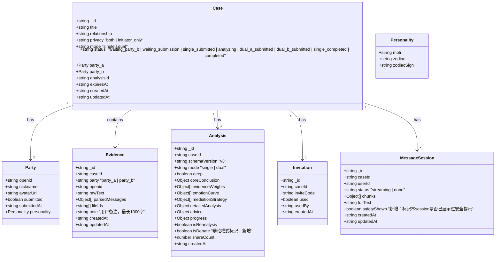
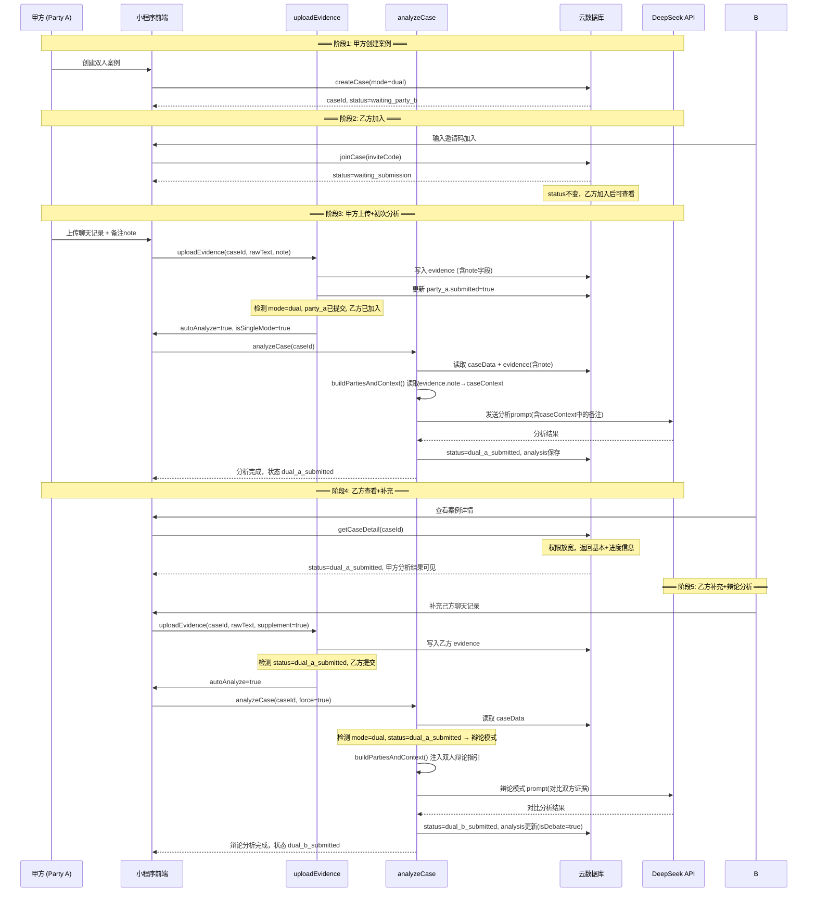
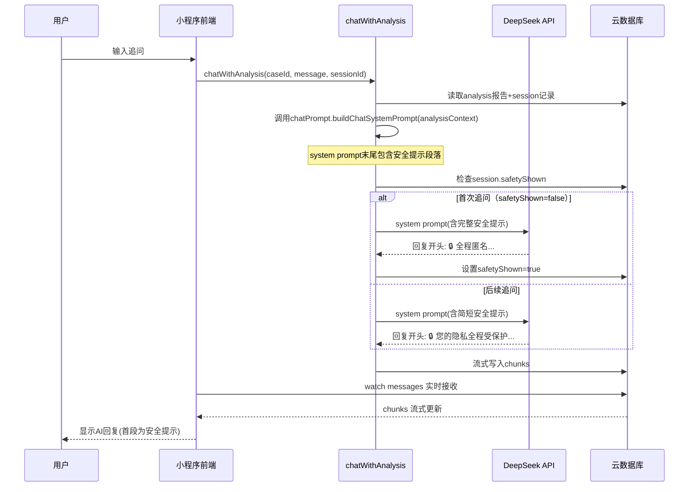
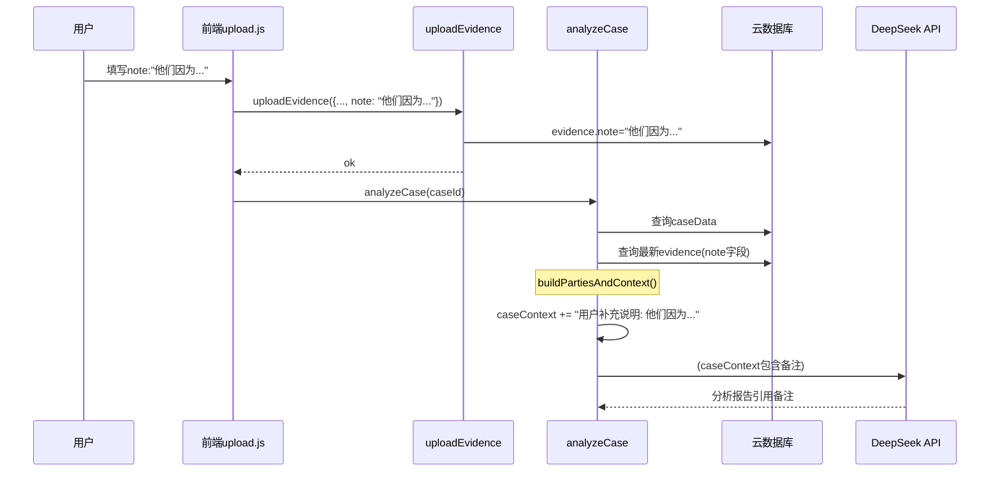
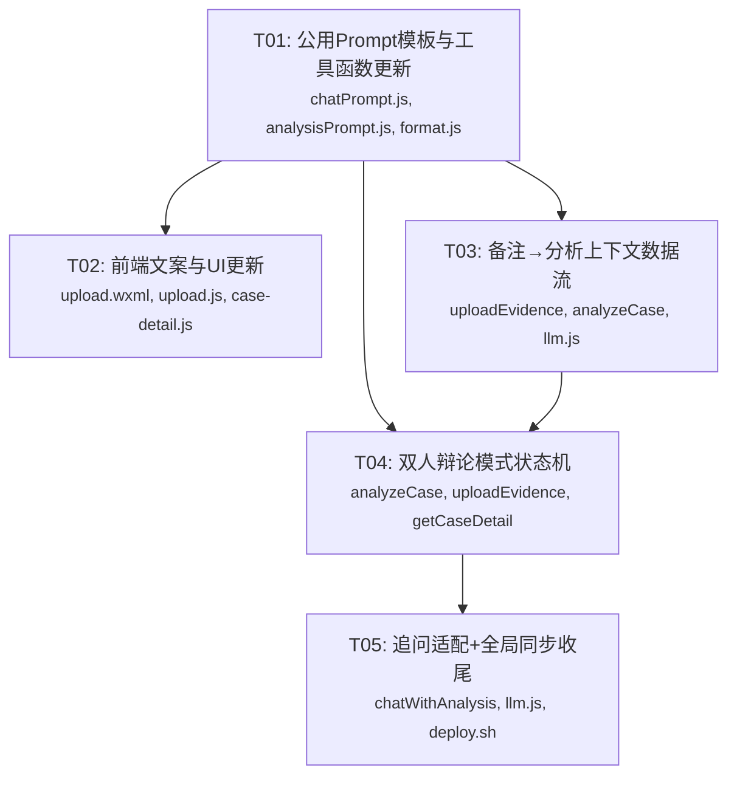

# AI 调解员「啷个对」— 系统架构设计 v2

> **版本**: v2.0  
> **日期**: 2026-07-15  
> **架构师**: 高见远 (Bob)  
> **基础架构**: 微信小程序 + 云开发 (CloudBase) + DeepSeek LLM  
> **状态**: 待评审

---

## Part A: 系统设计

---

### 1. 实现方案

#### 1.1 核心技术挑战

| 挑战 | 说明 | 应对策略 |
|------|------|---------|
| **双人状态机改造** | 需在不破坏现有单人流程前提下，新增 `dual_a_submitted` / `dual_b_submitted` 状态，处理辩论式重新分析 | 用 `status` 字段直接表达（而非新增 `dualState`），保持与现有状态检查兼容 |
| **辩论模式 Prompt 注入** | LLM 需感知当前分析是"甲方初版"还是"双方辩论版"，输出对比分析 | 在 `buildPartiesAndContext` 中检测辩论模式，动态追加双人辩论指引到 `caseContext` |
| **备注 → 分析上下文数据流** | 用户填写的备注需完整传递到 LLM 分析 prompt，确保引用 | 在 `analyzeCase` 的 `buildPartiesAndContext` 中查询 `evidence` 集合获取最新 `note`，追加到 `caseContext` |
| **隐私安全提示在追问中呈现** | 提示内容需由 AI 在追问回复中自然展示，非前端硬编码 | 在 `chatPrompt.js` 的 system prompt 末尾追加安全提示段落，AI 遵循指令在回复开头展示 |

#### 1.2 框架与架构

**技术栈不变**（维持现有架构）：

| 层 | 技术 | 说明 |
|----|------|------|
| 前端 | 微信小程序原生框架 | WXML + WXSS + JS，Page 组件模式 |
| 后端 | 微信云函数 (CloudBase) | Node.js 12+, `wx-server-sdk`，`async/await` 风格 |
| AI | DeepSeek API | `deepseek-v4-flash` (普通模式) / `deepseek-v4-pro` (深度模式) |
| 数据库 | 微信云数据库 | `cases`, `evidence`, `analyses`, `messages`, `invitations` 集合 |
| 通信 | 云函数调用 + DB Watch | 前端 `cloud.callFunction` + 实时监听 |

**架构模式**: 分层结构 — 前端 Page → 前端 Service 层 → 云函数 → LLM API / 云数据库

#### 1.3 关键设计决策（对应 PRD Q1-Q7）

| 问题 | 决策 | 理由 |
|------|------|------|
| **Q1**: 安全提示完整版/简版？ | 首次回复显示完整版，同一 session 后续显示简版。通过 `messages` 集合中的 `safetyShown` 字段追踪。 | 用户首次看到完整提示建立信任，后续简版减少重复感。 |
| **Q2**: 备注 maxlength 1000/2000？ | **1000**。PRD 建议 1000，小程序 textarea 性能与云函数传输均无压力。 | 1000 字足够描述大多数背景，后续可宽松。 |
| **Q3**: 辩论分析覆盖还是并存？ | **直接覆盖**（MVP 策略）。新分析文档标记 `isDebate: true`，保留 `isReanalysis` 标记。分析报告中标题区分"甲方陈述"/"乙方陈述"。 | 避免版本管理复杂度，用户可通过追问回溯。后续迭代可加并存对比。 |
| **Q4**: 隐私设置影响乙方查看？ | **遵循现有 privacy 设置**。`initiator_only` 模式下乙方只能看到"甲方已分析完成"不可看内容；`both` 模式下可查看完整分析。 | 与现有隐私模型一致，不改动 getCaseDetail 的隐私过滤逻辑。 |
| **Q5**: 辩论分析保留性格信息？ | **保留**。性格信息已存入 `cases.party_a.personality` / `party_b.personality`，`buildPartiesAndContext` 自动读取。 | 无需额外变更，已有逻辑支持。 |
| **Q6**: 备注可视化展示？ | **不展示**。仅注入 LLM prompt 上下文，用户可通过追问确认。 | 避免前端 UI 变化范围过大，PRD 已明确排除。 |
| **Q7**: 数据迁移？ | **无需迁移**。无存量双人案例。 | PRD 已确认。 |

---

### 2. 变更文件列表

#### 需求组 1：追问安全提示 + 措辞明确 + 积极建设

| 文件 | 变更类型 | 说明 |
|------|---------|------|
| `cloudfunctions/common/prompts/chatPrompt.js` | 修改 | `buildChatSystemPrompt` 末尾追加隐私安全提示段落（§7.1）；"回答要求"中追加措辞明确/积极建设约束（§7.3） |
| `cloudfunctions/chatWithAnalysis/index.js` | 修改 | 追问 prompt 构建时注入"避免可能/或许/也许"约束（可通过 system prompt 传递，与 chatPrompt.js 联动） |

#### 需求组 2：字数文案更正（3处）

| 文件 | 变更类型 | 说明 |
|------|---------|------|
| `miniprogram/pages/upload/upload.wxml` | 修改 | 相册卡片提示文案（第1处）：`ⓘ 若文字内容超过1万字，建议提取关键信息以缩短分析时间，您可自由选择是否使用压缩版` |
| `miniprogram/pages/upload/upload.js` | 修改 | `onChooseMedia` toast 文案（第2处）；`_handleOversizedText` 弹窗文案（第3处） |

#### 需求组 3：备注背景补充

| 文件 | 变更类型 | 说明 |
|------|---------|------|
| `miniprogram/pages/upload/upload.wxml` | 修改 | 备注区标签改为 `📝 说说你的想法`；提示文案改为引导性内容；`maxlength` 从 500→1000 |
| `cloudfunctions/analyzeCase/index.js` | 修改 | `buildPartiesAndContext` 方法中查询 evidence 集合获取最新记录的 `note` 字段，追加到 `caseContext` |

#### 需求组 4：双人辩论模式 + 状态机

| 文件 | 变更类型 | 说明 |
|------|---------|------|
| `cloudfunctions/analyzeCase/index.js` | 修改 | 状态机改造：支持 `dual_a_submitted`(甲方分析完成) / `dual_b_submitted`(辩论分析完成)；`handleInitial` 检测双人辩论模式；`buildPartiesAndContext` 检测辩论模式注入双人对比指引；`handleStrategy` 末阶段状态写入新值 |
| `cloudfunctions/uploadEvidence/index.js` | 修改 | 双人模式下甲方先上传允许自动分析（不要求乙方也提交）；检测 `supplement` 时处理辩论状态流转 |
| `cloudfunctions/getCaseDetail/index.js` | 修改 | 权限放宽：乙方加入后（`party_b.openid` 非空）可查看基本信息和进度，不再返回"无权访问"；分析完成前返回有限信息 |
| `cloudfunctions/common/prompts/analysisPrompt.js` | 修改 | `buildStrategyUserPrompt` 添加调解方向积极正面要求；辩论模式下注入双人对比分析指引 |
| `cloudfunctions/createCase/index.js` | 无需改动 | 双人模式初始状态 `waiting_party_b` 不变 |
| `cloudfunctions/joinCase/index.js` | 无需改动 | join 后状态更新逻辑不变 |

#### 前端适配

| 文件 | 变更类型 | 说明 |
|------|---------|------|
| `miniprogram/utils/format.js` | 修改 | `statusLabel` 函数新增 `dual_a_submitted` / `dual_b_submitted` 状态文案 |
| `miniprogram/pages/case-detail/case-detail.js` | 修改 | 状态变更监听中添加新状态的处理；`getOtherPartyLabel` 适配双人辩论流程 |
| `miniprogram/services/case.js` | 无需改动 | 服务层接口不变 |
| `miniprogram/services/chat.js` | 无需改动 | 服务层接口不变 |

---

### 3. 数据结构和接口变更

#### 3.1 `cases` 集合 Schema



**`status` 字段枚举值变更**：

| 状态值 | 说明 | 变更 |
|--------|------|------|
| `waiting_party_b` | 双人模式，等待乙方加入 | 已有 |
| `waiting_submission` | 等待双方提交证据 | 已有 |
| `single_submitted` | 单人已提交待分析 | 已有 |
| `analyzing` | 分析中 | 已有 |
| **`dual_a_submitted`** | **双人模式甲方先上传，分析完成** | **新增** |
| **`dual_b_submitted`** | **双人模式乙方补充辩论，分析完成** | **新增** |
| `single_completed` | 单人分析完成 | 已有 |
| `completed` | 双人分析完成 | 已有（当 mode=single 且双方都提交时仍用此值） |

**`Analysis` 集合新增字段**：

| 字段 | 类型 | 说明 |
|------|------|------|
| `isDebate` | `boolean` | `true` 表示这是乙方补充后的辩论模式分析 |

**`MessageSession` 集合新增字段**：

| 字段 | 类型 | 说明 |
|------|------|------|
| `safetyShown` | `boolean` | 是否已在本 session 展示过完整隐私安全提示 |

#### 3.2 云函数接口

**`uploadEvidence`** — 新增行为参数（接口不变，行为增强）：
- 当 `mode=dual` 且 `party=party_a` 且 `party_b.openid` 不为空时：允许自动分析（即使 `party_b.submitted=false`）
- 当 `mode=dual` 且 `status=dual_a_submitted` 且 `party=party_b` 时：视为补充证据，返回 `autoAnalyze=true`

**`analyzeCase`** — 新增辩论模式检测（接口不变，行为增强）：
- 检测条件：`caseData.mode === 'dual' && caseData.status === 'dual_a_submitted'` → 辩论模式
- 辩论模式下：注入双人对比指引到 prompt；分析完成后状态写入 `dual_b_submitted`
- 普通双人（双方都未提交过分析）：保持现有流程，状态流转 `analyzing` → `completed`

**`getCaseDetail`** — 权限逻辑变更：
- 当前：`!isPartyA && !isPartyB` → "无权访问"
- 变更后：允许 `party_b`（`openid` 非空）在分析完成前查看基本信息 + 进度

**`chatWithAnalysis`** — 追问 prompt 行为变更：
- 通过 `chatPrompt.buildChatSystemPrompt` 传入的安全提示段落，AI 自动在回复中加入安全提示
- 检测 `safetyShown` 字段：首次展示完整版，后续简版

---

### 4. 程序调用流程

#### 4.1 双人辩论模式时序（核心流程）



#### 4.2 追问安全提示流程



#### 4.3 备注数据流



---

### 5. 待明确事项（已决策见 §1.3）

| # | 事项 | 决策/假设 |
|---|------|----------|
| 1 | 追问安全提示中追踪"session"的粒度：同一用户的同一 case 维度，还是全局用户维度？ | **按 session（messages 集合中每个 sessionId）**。每个追问 session 独立记录是否有展示过。 |
| 2 | 辩论模式中甲方性格数据保留，乙方性格数据如何获取？ | 乙方在 upload 后的性格弹窗中填写（与甲方流程一致），已有 `updatePersonality` 云函数支持。 |
| 3 | `dual_a_submitted` 状态下甲方是否还能补充证据？ | **允许**。甲方补充视为"补充证据"（`supplement=true`），触发重新分析，状态回到 `analyzing` → `dual_a_submitted`（或 `dual_b_submitted` 如果乙方已提交过）。 |
| 4 | deploy.sh 是否需要修改以同步 common 模块？ | 当前 `deploy.sh` 已包含 common 同步。验证即可，无需修改。 |

---

## Part B: 任务分解

---

### 6. 所需依赖包

无需新增依赖包。当前项目基于以下现有依赖：

```
- wx-server-sdk@latest: 微信云开发 SDK（内置）
- https: Node.js 原生模块
```

所有能力基于现有技术栈，无需 `npm install` 新增包。

---

### 7. 任务列表（有序，按实现顺序）

#### T01: 项目基础设施 — 公用 Prompt 模板与工具函数更新

| 字段 | 内容 |
|------|------|
| **Task ID** | T01 |
| **Task Name** | 更新公用 Prompt 模板与状态工具函数 |
| **Source Files** | `cloudfunctions/common/prompts/chatPrompt.js`, `cloudfunctions/common/prompts/analysisPrompt.js`, `miniprogram/utils/format.js` |
| **Dependencies** | 无 |
| **Priority** | P0 |

**变更内容**：

1. **`cloudfunctions/common/prompts/chatPrompt.js`**：
   - `buildChatSystemPrompt` 末尾追加隐私安全提示段落（如 PRD §7.1）
   - "回答要求"中添加措辞明确约束：避免"可能""或许""也许"等模糊词汇
   - "回答要求"中添加积极建设约束：偏积极正面方向，但保持客观
   - 添加 `safetyShown` 参数控制：当 `true` 时输出简版安全提示，否则完整版

2. **`cloudfunctions/common/prompts/analysisPrompt.js`**：
   - `buildStrategyUserPrompt` 中添加调解方向要求段（PRD §7.2）
   - 添加 `buildDebateContextBlock` 新函数：当检测辩论模式时注入双人对比指引（PRD §7.4）
   - `buildCoreUserPrompt` 尾部添加调解方向说明

3. **`miniprogram/utils/format.js`**：
   - `statusLabel` 函数新增 `dual_a_submitted` → `"甲方已提交（等待乙方补充）"`
   - `statusLabel` 函数新增 `dual_b_submitted` → `"双方辩论分析完成"`

**验收标准**：
- [ ] `buildChatSystemPrompt` 返回的 prompt 末尾包含安全提示段落
- [ ] `buildChatSystemPrompt` 接受 `safetyShown` 参数控制完整/简版
- [ ] 回答要求中包含"避免使用可能/或许/也许"约束
- [ ] `buildStrategyUserPrompt` 中包含调解方向要求
- [ ] `buildPartiesAndContext` 调用 `buildDebateContextBlock`（该函数需导出）
- [ ] `format.js` 能正确映射新状态值

---

#### T02: 前端文案与 UI 更新

| 字段 | 内容 |
|------|------|
| **Task ID** | T02 |
| **Task Name** | 更新上传页文案与案例详情页状态适配 |
| **Source Files** | `miniprogram/pages/upload/upload.wxml`, `miniprogram/pages/upload/upload.js`, `miniprogram/pages/case-detail/case-detail.js` |
| **Dependencies** | T01（依赖 format.js 的新状态标签） |
| **Priority** | P0 |

**变更内容**：

1. **`miniprogram/pages/upload/upload.wxml`**（4处变更）：
   - 相册卡片提示文案（第9行附近）：改为"ⓘ 若文字内容超过1万字，建议提取关键信息以缩短分析时间，您可自由选择是否使用压缩版"
   - 备注区标题：改为"📝 说说你的想法"
   - 备注区提示文案：改为"补充背景、看法或想对调解员提出的问题，例如「大家看这个聊天记录有什么问题？」"
   - 备注区 `maxlength`：从 `500` 改为 `1000`

2. **`miniprogram/pages/upload/upload.js`**（2处变更）：
   - `onChooseMedia` 中 toast 文案（第73行）：改为"提示：文字较多时可提取关键信息缩短分析时间"
   - `_handleOversizedText` 中弹窗文案（第203行）：包含字数 + "建议提取关键信息可缩短分析时间（不影响分析质量）"

3. **`miniprogram/pages/case-detail/case-detail.js`**：
   - `onShow` / `loadDetail` 中处理 `dual_a_submitted` 和 `dual_b_submitted` 状态
   - 状态变更提示中添加 `dual_a_submitted` → 显示"甲方分析完成，等待乙方补充"
   - 状态变更提示中添加 `dual_b_submitted` → 显示"双方辩论分析完成"
   - `getOtherPartyLabel` 适配：`dual_a_submitted` 时乙方显示"待补充"，甲方显示"已分析"

**验收标准**：
- [ ] 相册卡片提示文案已更新为建议性用语
- [ ] 首次选择相册的 toast 已更新
- [ ] 文字超限弹窗文案包含"建议提取关键信息可缩短分析时间（不影响分析质量）"
- [ ] 备注区标题和文案已更新为引导性内容
- [ ] 备注区 `maxlength` 为 1000
- [ ] 案例详情页能正确显示 `dual_a_submitted` 和 `dual_b_submitted` 的状态文案

---

#### T03: 后端数据流 — 备注注入分析上下文

| 字段 | 内容 |
|------|------|
| **Task ID** | T03 |
| **Task Name** | 打通备注到分析上下文的完整数据流 |
| **Source Files** | `cloudfunctions/uploadEvidence/index.js`, `cloudfunctions/analyzeCase/index.js`, `cloudfunctions/common/llm.js` |
| **Dependencies** | T01（依赖 analysisPrompt.js 的导出接口） |
| **Priority** | P0 |

**变更内容**：

1. **`cloudfunctions/uploadEvidence/index.js`**：
   - 确认 `note` 字段在新建和更新 evidence 时均正确写入（当前已写，增加日志确认）
   - 双人模式下：当 `mode=dual` 且 `party=party_a` 且 `party_b.openid` 非空时，即使 `party_b.submitted=false` 也设置 `autoAnalyze=true`

2. **`cloudfunctions/analyzeCase/index.js`**：
   - 修改 `buildPartiesAndContext` 方法：
     - 新增参数或内部查询：从 `evidence` 集合查询该 case 最新记录
     - 提取 `evidence.note` 内容
     - 追加到 `caseContext`：`caseContext += '\n用户补充说明: ' + note`
   - 确保 `getMergedMessages` 获取证据时包含 note 字段（用于后续阶段访问）

3. **`cloudfunctions/common/llm.js`**：
   - 确认 `analyzeChatStage` 和 `analyzeChat` 等函数能正确处理含 note 的 `caseContext`（当前已支持，无需修改，仅需验证）

**验收标准**：
- [ ] `uploadEvidence` 验证 note 正确写入 evidence 集合
- [ ] `buildPartiesAndContext` 读取最新 evidence.note 并追加到 caseContext
- [ ] caseContext 中的备注内容出现在传给 LLM 的 prompt 中
- [ ] 双人模式下甲方先上传也能触发自动分析（不需要乙方提交）

---

#### T04: 双人模式状态机 — 辩论流程改造

| 字段 | 内容 |
|------|------|
| **Task ID** | T04 |
| **Task Name** | 实现双人辩论模式状态机与权限放宽 |
| **Source Files** | `cloudfunctions/analyzeCase/index.js`, `cloudfunctions/uploadEvidence/index.js`, `cloudfunctions/getCaseDetail/index.js` |
| **Dependencies** | T01, T03 |
| **Priority** | P1 |

**变更内容**：

1. **`cloudfunctions/analyzeCase/index.js`** — 核心状态机改造：
   - `handleInitial` 中：
     - 新增辩论模式检测：`isDebate = caseData.mode === 'dual' && caseData.status === 'dual_a_submitted'`
     - 辩论模式下：`isSingleMode = false`（双方证据都考虑），`mode = 'dual'`
     - 卡死检测：对 `analyzing` 状态的检测增加对辩论场景的兼容
   - `handleCore` 中：
     - 调用 `buildPartiesAndContext` 时传入 `isDebate` 标记
     - `isDebate=true` 时，`caseContext` 自动注入双人对比分析指引
   - `handleStrategy`（末阶段）中：
     - 根据模式写入不同状态：
       - `isDebate=true` → `dual_b_submitted`
       - `mode=dual && !isDebate` → 现有逻辑（双方都提交走 `completed`）
       - 新增分支：`mode=dual && isSingleMode`（即甲方初版分析）→ `dual_a_submitted`
   - `runSequentialPipeline` 兼容辩论模式

2. **`cloudfunctions/uploadEvidence/index.js`**：
   - 自动分析检测逻辑增强：
     - 新增检测：`mode=dual && status === 'dual_a_submitted' && party=party_b` → 允许自动分析（辩论模式）
     - 现有：`mode=dual && party_a.submitted && party_b.submitted` → 保持
   - 状态更新逻辑：
     - 乙方在 `dual_a_submitted` 状态下上传证据 → 将 status 设为 `analyzing`（触发重新分析）

3. **`cloudfunctions/getCaseDetail/index.js`**：
   - 权限校验逻辑修改：
     - 当前：`if (!isPartyA && !isPartyB) return 无权访问`
     - 改为：`if (!isPartyA && !isPartyB) return 无权访问`（保持不动，甲方乙方均能访问）
     - 重点放宽：乙方加入后，即使分析未完成，也允许获取基本信息
   - 隐私过滤保持：`initiator_only` 模式下乙方看不到分析内容，只能看到进度

**验收标准**：
- [ ] 双人模式下甲方上传后触发分析，完成后状态为 `dual_a_submitted`
- [ ] 乙方补充证据后触发辩论模式重新分析，完成后状态为 `dual_b_submitted`
- [ ] 辩论模式分析结果标记 `isDebate: true`
- [ ] 乙方加入后即可查看案例基本信息（不报"无权访问"）
- [ ] 单人模式不受影响，状态流转不变

---

#### T05: 追问适配与全局同步收尾

| 字段 | 内容 |
|------|------|
| **Task ID** | T05 |
| **Task Name** | 追问模块适配 + 云函数同步 + 全局审查 |
| **Source Files** | `cloudfunctions/chatWithAnalysis/index.js`, `cloudfunctions/common/llm.js`, `deploy.sh` |
| **Dependencies** | T01, T04 |
| **Priority** | P1 |

**变更内容**：

1. **`cloudfunctions/chatWithAnalysis/index.js`**：
   - 在构建 system prompt 时，调用 `chatPrompt.buildChatSystemPrompt(contextStr)`（当前已调用，无需修改）
   - 新增 `safetyShown` 字段追踪：在读取 session 时检查 `safetyShown`
   - 首次追问（`safetyShown=false`）：传入完整版安全提示
   - 后续追问（`safetyShown=true`）：传入简版安全提示
   - LLM 返回后更新 `safetyShown=true`

2. **`cloudfunctions/common/llm.js`**：
   - 验证 `chatWithAnalysis` 函数正确传递所有 prompt 参数
   - 确认 `buildChatSystemPrompt` 的 `safetyShown` 参数在调用链中传递

3. **`deploy.sh`**：
   - 确认部署脚本已包含 `common` 模块同步到所有云函数（当前已有，确认即可）
   - 如需修改：在同步命令中确保 `common/prompts/` 下的变更被正确部署

**验收标准**：
- [ ] 追问首次回复开头包含完整隐私安全提示
- [ ] 同一 session 后续追问回复开头为简版安全提示
- [ ] 避免模糊词汇的约束生效（追问回答中无"可能""或许""也许"）
- [ ] `deploy.sh` 正确同步 common 模块到所有云函数
- [ ] 全局一致性审查通过

---

### 8. 共享知识

**状态枚举值（新增）**：
- `dual_a_submitted`：双人模式，甲方已上传证据并分析完成，等待乙方补充
- `dual_b_submitted`：双人模式，乙方已补充证据并完成辩论分析

**辩论模式检测条件**：
```javascript
var isDebate = caseData.mode === 'dual' && caseData.status === 'dual_a_submitted';
```
当 `isDebate=true` 时，`analyzeCase` 会：
1. 在 `buildPartiesAndContext` 中注入双人辩论指引
2. 在 `analysisPrompt` 中使用辩论模式 prompt
3. 末阶段写入 `dual_b_submitted` 而非 `completed`

**Note 数据流关键位置**：
- 写入：`uploadEvidence/index.js` → `evidence.note`
- 读取：`analyzeCase/index.js` 的 `buildPartiesAndContext()` → 查询 `evidence` 集合获取最新记录 → 提取 `note` → 追加到 `caseContext`
- 使用：LLM prompt 的 `## 案件背景` 区块中可见

**安全提示追踪**：
- 字段：`messages` 集合中 `safetyShown`（boolean）
- 首次追问：`safetyShown=false` → 完整版安全提示
- 后续追问：`safetyShown=true` → 简版安全提示

**代码风格约束**：
- 保持现有代码风格：`var` 而非 `const/let`，ES5 函数风格
- 所有 DB 查询使用 `await` 风格
- API 响应格式统一为 `{ code, data, message }`
- 所有时间使用 ISO 8601 UTC 格式

**`uploadEvidence` 自动分析检测逻辑**（变更后）：
```javascript
// 双人模式: 甲方已提交且乙方已加入 → 允许自动分析（新增）
var canAutoAnalyzeDualA = updatedData.mode === 'dual' && party === 'party_a' && updatedData.party_a.submitted && hasPartyB;

// 双人模式: 辩论场景 — 乙方在 dual_a_submitted 下补充
var canAutoAnalyzeDebate = updatedData.mode === 'dual' && party === 'party_b' && updatedData.status === 'dual_a_submitted';

// 双人模式: 双方都已提交 → 自动分析（现有）
var canAutoAnalyzeBoth = hasPartyB && updatedData.party_a.submitted && updatedData.party_b.submitted;

// 单人模式: 甲方已提交 → 自动分析（现有）
var isSingleMode = updatedData.mode === 'single' || (!hasPartyB);
var canAutoAnalyzeSingle = isSingleMode && updatedData.party_a.submitted;

var autoAnalyze = canAutoAnalyzeDualA || canAutoAnalyzeDebate || canAutoAnalyzeBoth || canAutoAnalyzeSingle;
```

---

### 9. 任务依赖关系图



---

> **附录文件**：
> - 时序图: `docs/sequence-diagram.mermaid`
> - 类图: `docs/class-diagram.mermaid`
