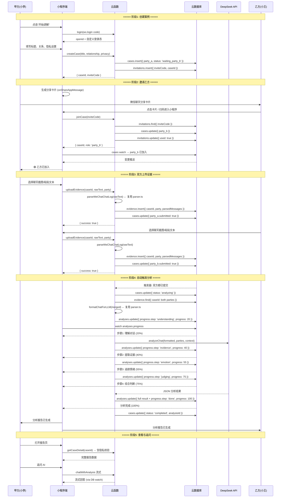
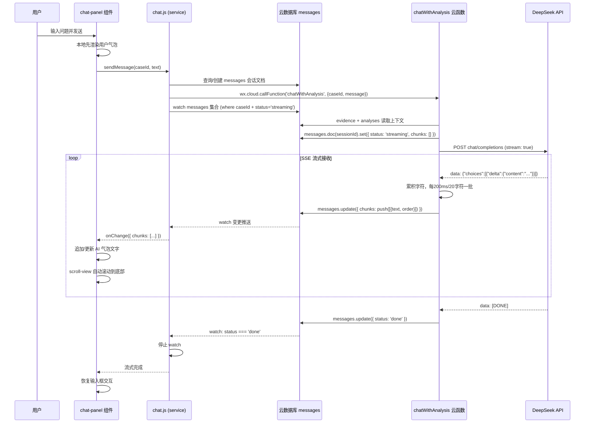
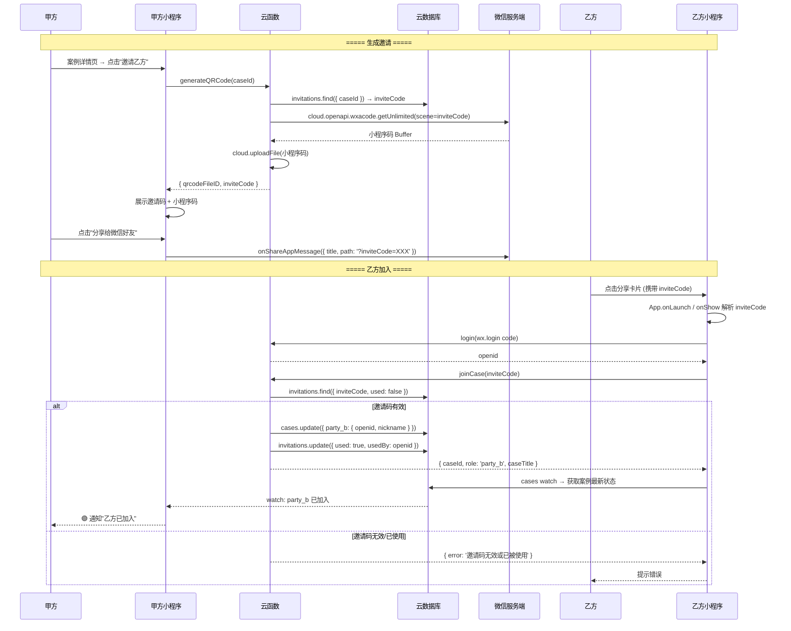
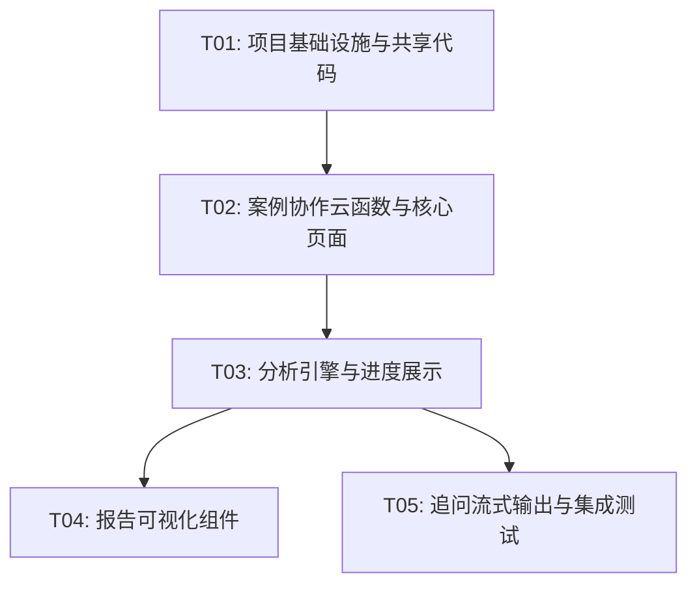

# AI 调解员 — 微信小程序版 架构设计文档

> **版本**: v1.0  
> **日期**: 2025-07-14  
> **作者**: 高见远（架构师）  
> **依赖**: [PRD-miniapp.md](./PRD-miniapp.md) | [Web 版 PRD](./PRD-redesign.md)  
> **状态**: 待评审

---

## 目录

1. [实现方案与框架选型](#1-实现方案与框架选型)
2. [文件结构](#2-文件结构)
3. [数据流与时序图](#3-数据流与时序图)
4. [数据库安全规则设计](#4-数据库安全规则设计)
5. [任务列表](#5-任务列表)
6. [共享知识约定](#6-共享知识约定)
7. [待明确事项](#7-待明确事项)

---

## 1. 实现方案与框架选型

### 1.1 小程序框架：原生 WXML/WXSS

**选型结论：微信小程序原生框架（WXML + WXSS + JS/TS）**

| 维度 | 原生 | Taro (React) | uni-app |
|------|------|-------------|---------|
| **Web 组件复用** | ❌ 不可复用 | ⚠️ 部分可复用（事件、生命周期、样式差异大） | ❌ Vue 语法，React 版不成熟 |
| **Canvas 2D** | ✅ 第一公民，API 完整 | ⚠️ 通过 Taro 封装，部分 API 受限 | ⚠️ 跨端统一 API，微信特性受限 |
| **性能** | ✅ 最优，无框架开销 | ⚠️ setData 桥接层有性能损耗 | ⚠️ 跨端编译有性能损耗 |
| **微信 API 兼容** | ✅ 100% 兼容，第一时间支持新 API | ⚠️ 需等待 Taro 适配 | ⚠️ 需等待 uni-app 适配 |
| **云开发集成** | ✅ wx.cloud.* 原生调用 | ✅ 支持 | ✅ 支持 |
| **包体积** | ✅ 最小 | ⚠️ +~150KB runtime | ⚠️ +~200KB runtime |
| **团队学习成本** | 低（标准小程序开发） | 中（需了解 Taro 差异） | 中 |
| **跨端能力** | ❌ 仅微信 | ✅ 支持 H5/支付宝等 | ✅ 支持多端 |

**核心决策理由**：

1. **前端重写率已达 95%**：PRD §6.3 已明确 Web 版前端几乎全部重写。Taro 的 React 复用优势被严重稀释——组件事件绑定（`bindtap` vs `onClick`）、样式系统（rpx vs Tailwind）、路由（`wx.navigateTo` vs React Router）、生命周期（`onLoad/onShow` vs `useEffect`）差异巨大，能复用的仅 TypeScript 类型和工具函数。

2. **Canvas 2D 情绪曲线是核心交互**：原生 Canvas 2D API 在微信小程序中是一等公民，`<canvas type="2d">` + `Canvas.getContext('2d')` 无任何兼容问题。Taro 的 Canvas 封装历史上出现过多次 breaking change。

3. **云开发最佳搭配**：`wx.cloud.callFunction()` + `wx.cloud.database().watch()` 是云开发的原生搭配，原生框架提供最好的 TypeScript 类型推断和 IDE 提示。

4. **包体积敏感**：小程序主包限制 2MB，原生框架零额外运行时开销，为 Canvas 绘制的分享图片等功能留出空间。

5. **跨端非当前需求**：PRD §7 Q6 明确"初期不做互通，独立部署"，且没有多平台发布计划。如果未来需要跨端，云函数逻辑 100% 可迁移。

### 1.2 图表方案：Canvas 2D + CSS

| 图表需求 | 方案 | 理由 |
|---------|------|------|
| **情绪曲线折线图** | Canvas 2D API（`wx.createSelectorQuery` + `Canvas.getContext('2d')`） | PRD §4.4 明确建议。轻量，无依赖。约 200 行绘制逻辑 |
| **分数对比条** | 纯 CSS（flex + 渐变 background） | 极简条形图，CSS 即可 |
| **置信度进度条** | 纯 CSS（border-radius + 动画） | 同上 |
| **调解步骤时间线** | CSS `border-left` + `::before` 伪元素 | 纯装饰性组件 |
| **分享卡片（P2）** | Canvas 2D 离屏绘制 → `wx.canvasToTempFilePath` | P2 需求，复用 Canvas 2D 技能 |

**不引入 ECharts 的理由**：情绪曲线仅需绘制 2 条折线 + 坐标轴，ECharts（~900KB）对小程序而言过于沉重。

### 1.3 流式输出方案：云函数 → 数据库 watch

**选型结论：云函数逐 chunk 写入 `messages` 集合 → 小程序 `watch` 增量渲染**

```
┌─────────────────┐     ┌──────────────┐     ┌──────────────┐
│  DeepSeek API   │────▶│  云函数       │────▶│  云数据库     │
│  (SSE stream)   │     │ chatWithAnalysis│   │ messages     │
└─────────────────┘     └──────┬───────┘     └──────┬───────┘
                              │                     │
                              │ 节流 200ms/批次     │ watch 变更推送
                              │ 每批写一条 doc       │
                              └─────────────────────┼──────────┐
                                                    │          │
                                                    ▼          ▼
                                              ┌──────────────────┐
                                              │   小程序端        │
                                              │ chat-panel 组件  │
                                              └──────────────────┘
```

**实现细节**：

```
云函数 chatWithAnalysis:
1. 创建 messages 会话文档 { _id, caseId, userId, chunks: [], status: 'streaming', createdAt }
2. 调用 LLM SSE → 逐 token 接收
3. 每 200ms 或每累积 20 字符，将 chunk 追加到 chunks 数组：
   db.collection('messages').doc(sessionId).update({
     data: { chunks: _.push([{ text: '...', order: N }]) }
   })
4. 流结束后更新 status: 'done'

小程序 chat-panel:
1. db.collection('messages').where({ caseId, status: 'streaming' }).watch({ onChange })
2. onChange: 读取 snapshot.docs[0].chunks，按 order 排序，逐条追加渲染
3. 使用 scroll-view scroll-top 自动滚动到底部
4. status === 'done' 时停止 watch
```

**为什么不用 WebSocket**：
- 微信云开发不内置 WebSocket 服务，需自建或使用第三方
- 数据库 watch 方案零额外成本，实现简单
- 200ms 批处理下延迟可接受（用户感知不到差异）
- watch 天然支持断线重连和状态恢复

**降级方案**：低版本基础库（<2.9.0）降级为轮询（`setInterval` 每 1s 拉取 `messages` 最新 chunks）。

### 1.4 云函数代码组织：Monorepo + 构建脚本

**选型结论：独立目录 + `common/` 共享层 + 构建脚本复制**

```
cloudfunctions/
├── common/                    # 共享代码（不部署，构建时复制）
│   ├── types.ts               # ← Web 版 src/types/index.ts 复用
│   ├── parser.ts              # ← Web 版 server/src/services/parser.ts 复用
│   ├── llm.ts                 # ← Web 版 server/src/services/llm.ts 复用
│   ├── analysisMigration.ts  # ← Web 版 src/utils/analysisMigration.ts 复用
│   └── prompts/
│       ├── analysisPrompt.ts  # ← Web 版 server/src/prompts/analysisPrompt.ts 复用
│       └── chatPrompt.ts      # ← Web 版 server/src/prompts/chatPrompt.ts 复用
├── login/                     # 独立云函数
│   ├── index.js
│   ├── package.json
│   └── common/  ← 构建时复制
├── createCase/
│   ├── index.js
│   ├── package.json
│   └── common/
├── joinCase/
│   ├── index.js
│   ├── package.json
│   └── common/
├── uploadEvidence/
│   ├── index.js
│   ├── package.json
│   └── common/
├── analyzeCase/
│   ├── index.js
│   ├── package.json
│   └── common/
├── chatWithAnalysis/
│   ├── index.js
│   ├── package.json
│   └── common/
├── getCaseDetail/
│   ├── index.js
│   ├── package.json
│   └── common/
├── getCaseList/
│   ├── index.js
│   ├── package.json
│   └── common/
├── generateQRCode/
│   ├── index.js
│   ├── package.json
│   └── common/
└── scripts/
    └── build-cf.js            # 构建脚本：复制 common/ → 各云函数目录
```

**共享方式**：
- `common/` 目录存放所有复用代码
- 构建脚本 `scripts/build-cf.js` 在部署前执行，将 `common/` 内容复制到每个云函数的 `common/` 子目录
- 云函数内通过 `const { parseWeChatChatLog } = require('./common/parser')` 引用
- TypeScript 源文件（`.ts`）在复制时编译为 `.js`（或直接使用 `.js` 格式）

**为什么不合并为单个云函数**：
虽然合并可简化共享，但 9 个云函数职责分明、独立扩缩容、独立超时控制（`analyzeCase` 可能需要 60s，而 `login` 只需 3s），拆分更合理。

---

## 2. 文件结构

### 2.1 小程序端目录结构

```
miniprogram/
├── app.js                          # 入口：初始化云开发、全局 app 实例
├── app.json                        # 页面注册、窗口配置、tabBar
├── app.wxss                        # 全局样式变量、公共样式
├── project.config.json             # 项目配置（appid、云函数根目录）
├── sitemap.json                    # 搜索配置
│
├── pages/
│   ├── index/                      # 首页：案例列表 + 创建入口
│   │   ├── index.js
│   │   ├── index.json
│   │   ├── index.wxml
│   │   └── index.wxss
│   ├── create-case/                # 创建案例页（标题、关系、隐私设置）
│   │   ├── create-case.js
│   │   ├── create-case.json
│   │   ├── create-case.wxml
│   │   └── create-case.wxss
│   ├── case-detail/                # 案例详情页：双人状态 + 上传 + 查看
│   │   ├── case-detail.js
│   │   ├── case-detail.json
│   │   ├── case-detail.wxml
│   │   └── case-detail.wxss
│   ├── upload/                     # 上传证据页
│   │   ├── upload.js
│   │   ├── upload.json
│   │   ├── upload.wxml
│   │   └── upload.wxss
│   ├── ocr-preview/                # OCR 预览+编辑页（P1）
│   │   ├── ocr-preview.js
│   │   ├── ocr-preview.json
│   │   ├── ocr-preview.wxml
│   │   └── ocr-preview.wxss
│   └── report/                     # 分析报告页（4层递进结构）
│       ├── report.js
│       ├── report.json
│       ├── report.wxml
│       └── report.wxss
│
├── components/
│   ├── case-card/                  # 案例列表卡片
│   │   ├── case-card.js
│   │   ├── case-card.json
│   │   ├── case-card.wxml
│   │   └── case-card.wxss
│   ├── party-status/               # 双人状态面板（甲乙方提交状态）
│   │   ├── party-status.js
│   │   ├── party-status.json
│   │   ├── party-status.wxml
│   │   └── party-status.wxss
│   ├── evidence-section/           # 证据上传/查看操作区
│   │   ├── evidence-section.js
│   │   ├── evidence-section.json
│   │   ├── evidence-section.wxml
│   │   └── evidence-section.wxss
│   ├── invite-panel/               # 邀请面板（邀请码 + 分享按钮）
│   │   ├── invite-panel.js
│   │   ├── invite-panel.json
│   │   ├── invite-panel.wxml
│   │   └── invite-panel.wxss
│   ├── analysis-progress/          # 分析进度条（CoT 步骤展示）
│   │   ├── analysis-progress.js
│   │   ├── analysis-progress.json
│   │   ├── analysis-progress.wxml
│   │   └── analysis-progress.wxss
│   ├── core-verdict/               # 核心结论卡片（分数对比、置信度）
│   │   ├── core-verdict.js
│   │   ├── core-verdict.json
│   │   ├── core-verdict.wxml
│   │   └── core-verdict.wxss
│   ├── emotion-curve/              # Canvas 2D 情绪曲线图表
│   │   ├── emotion-curve.js
│   │   ├── emotion-curve.json
│   │   ├── emotion-curve.wxml
│   │   └── emotion-curve.wxss
│   ├── evidence-weights/           # 关键证据权重列表
│   │   ├── evidence-weights.js
│   │   ├── evidence-weights.json
│   │   ├── evidence-weights.wxml
│   │   └── evidence-weights.wxss
│   ├── mediation-strategy/         # 调解策略步骤列表
│   │   ├── mediation-strategy.js
│   │   ├── mediation-strategy.json
│   │   ├── mediation-strategy.wxml
│   │   └── mediation-strategy.wxss
│   ├── detailed-analysis/          # 详细分析 Tab 区（人物画像、争议焦点、时间线）
│   │   ├── detailed-analysis.js
│   │   ├── detailed-analysis.json
│   │   ├── detailed-analysis.wxml
│   │   └── detailed-analysis.wxss
│   └── chat-panel/                 # 追问聊天面板（流式渲染）
│       ├── chat-panel.js
│       ├── chat-panel.json
│       ├── chat-panel.wxml
│       └── chat-panel.wxss
│
├── services/                       # 云函数调用封装层
│   ├── auth.js                     # 登录、获取用户信息
│   ├── case.js                     # createCase, joinCase, getCaseDetail, getCaseList
│   ├── evidence.js                 # uploadEvidence
│   ├── analysis.js                 # analyzeCase, 分析结果读取
│   └── chat.js                     # chatWithAnalysis, 流式消息 watch
│
├── utils/
│   ├── watch.js                    # 云数据库 watch 封装（含降级轮询）
│   ├── storage.js                  # wx.setStorageSync 封装（用户偏好缓存）
│   ├── format.js                   # 日期/文本格式化工具
│   └── share.js                    # 微信分享卡片生成逻辑
│
├── types/
│   └── index.js                    # ← Web 版 src/types/index.ts 类型定义（JSDoc 注释版）
│
└── styles/
    └── variables.wxss              # CSS 变量：颜色、字号、间距
```

### 2.2 云函数目录结构

```
cloudfunctions/
├── common/                         # 共享代码层（构建时复制到各云函数）
│   ├── types.js                    # ← src/types/index.ts 转换
│   ├── parser.js                   # ← server/src/services/parser.ts 转换
│   ├── llm.js                      # ← server/src/services/llm.ts 转换
│   ├── analysisMigration.js        # ← src/utils/analysisMigration.ts 转换
│   └── prompts/
│       ├── analysisPrompt.js       # ← server/src/prompts/analysisPrompt.ts 转换
│       └── chatPrompt.js           # ← server/src/prompts/chatPrompt.ts 转换
│
├── login/
│   ├── index.js                    # wx.login → openid
│   ├── config.json                 # 云函数配置（超时、环境变量）
│   └── package.json
│
├── createCase/
│   ├── index.js                    # 创建案例 + 邀请码
│   ├── config.json
│   └── package.json
│
├── joinCase/
│   ├── index.js                    # 根据邀请码加入案例
│   ├── config.json
│   └── package.json
│
├── uploadEvidence/
│   ├── index.js                    # 接收证据、解析聊天记录
│   ├── config.json
│   └── package.json
│
├── analyzeCase/
│   ├── index.js                    # 合并证据 → LLM 分析 → 写入结果
│   ├── config.json
│   └── package.json
│
├── chatWithAnalysis/
│   ├── index.js                    # 流式追问 LLM → 批量写入 messages
│   ├── config.json
│   └── package.json
│
├── getCaseDetail/
│   ├── index.js                    # 案例详情（含权限校验）
│   ├── config.json
│   └── package.json
│
├── getCaseList/
│   ├── index.js                    # 用户案例列表（分页）
│   ├── config.json
│   └── package.json
│
├── generateQRCode/
│   ├── index.js                    # 生成小程序码
│   ├── config.json
│   └── package.json
│
└── scripts/
    └── build-cf.js                 # 构建脚本：TypeScript 编译 + common/ 复制
```

---

## 3. 数据流与时序图

### 3.1 双人协作全流程时序图



### 3.2 追问流式输出时序图



### 3.3 邀请加入时序图



---

## 4. 数据库安全规则设计

### 4.1 集合概览

| 集合 | 创建者 | 读权限 | 写权限 | 特殊规则 |
|------|--------|--------|--------|---------|
| `cases` | 甲方（云函数） | 甲/乙方 | 甲/乙方（仅自己的字段） | 状态机保护 |
| `evidence` | 云函数 | 分析前仅自己；分析后依隐私 | 云函数 only | 字段级隔离 |
| `analyses` | 云函数 | 依隐私设置 | 云函数 only | 仅完成状态可读 |
| `invitations` | 云函数 | 案例参与者 | 云函数 only | 一次性使用 |

### 4.2 `cases` 集合安全规则

```json
{
  "read": "doc.party_a.openid == auth.openid || doc.party_b.openid == auth.openid",
  "create": false,
  "update": "auth.openid == doc.party_a.openid || auth.openid == doc.party_b.openid",
  "delete": false
}
```

**说明**：
- 读：仅案例参与者可读
- 创建：仅云函数可创建（`create: false` 强制通过云函数 `createCase` 写入）
- 更新：参与者可更新（如重新上传覆盖提交状态），但关键字段（`status`、`analysisId`、`party_b`）由云函数管控
- 删除：不允许物理删除（软删除可后期加 `isDeleted` 字段）

### 4.3 `evidence` 集合安全规则

```json
{
  "read": "doc.openid == auth.openid || (get('database.cases.${doc.caseId}').status == 'completed' && get('database.cases.${doc.caseId}').privacy == 'both')",
  "create": false,
  "update": false,
  "delete": false
}
```

**说明**：
- 读：证据提交者本人 OR（分析已完成 AND 隐私设为"双方可见"）
- 创建/更新/删除：仅云函数可操作
- `get()` 函数跨集合查询 `cases` 的 `status` 和 `privacy` 字段实现动态权限
- **注意**：云数据库安全规则的 `get()` 函数有性能开销，如果遇到超时问题，可在云函数层做权限校验（`getCaseDetail` 中手动过滤）

### 4.4 `analyses` 集合安全规则

```json
{
  "read": "get('database.cases.${doc.caseId}').party_a.openid == auth.openid || (get('database.cases.${doc.caseId}').party_b.openid == auth.openid && get('database.cases.${doc.caseId}').privacy == 'both')",
  "create": false,
  "update": false,
  "delete": false
}
```

**说明**：
- 读：甲方始终可读 OR (乙方 AND 隐私设置="双方可见")
- 创建/更新/删除：仅云函数可操作
- 隐私控制核心：`privacy == 'both'` 时才允许乙方读取分析结果

### 4.5 `invitations` 集合安全规则

```json
{
  "read": "get('database.cases.${doc.caseId}').party_a.openid == auth.openid || get('database.cases.${doc.caseId}').party_b.openid == auth.openid",
  "create": false,
  "update": false,
  "delete": false
}
```

**说明**：
- 读：仅案例参与者
- 所有写操作由云函数执行（生成邀请码、标记已使用）

### 4.6 `messages` 集合（追问会话）

```
messages {
  _id: string
  caseId: string
  userId: string               // 追问者 openid
  chunks: [{ text: string, order: number }]
  status: 'streaming' | 'done'
  fullText: string             // 完成后拼接全文
  createdAt: string
  updatedAt: string
}
```

```json
{
  "read": "doc.userId == auth.openid",
  "create": false,
  "update": false,
  "delete": false
}
```

**说明**：追问消息仅追问者本人可见。对方（如果也在同一案例中）通过各自独立的追问会话隔离。

---

## 5. 任务列表

### 5.1 任务概览

| 任务 | 优先级 | 依赖 | 预估工作量 | 可复用代码比例 |
|------|--------|------|-----------|--------------|
| T01 项目基础设施与共享代码 | P0 | 无 | 1.5 人天 | ~60%（类型/parser/llm 直接移植） |
| T02 案例协作云函数与核心页面 | P0 | T01 | 2.5 人天 | ~10%（仅 parser 调用） |
| T03 分析引擎与进度展示 | P0 | T02 | 1.5 人天 | ~80%（analyzeChat 核心逻辑） |
| T04 报告可视化组件 | P0 | T03 | 2 人天 | ~5%（仅类型定义） |
| T05 追问流式输出与集成测试 | P0 | T03 | 1.5 人天 | ~90%（chatWithAnalysis 核心逻辑） |

> 工作量为单人力估算，实际可并行 T04 和 T05。

---

### 5.2 详细任务

#### T01: 项目基础设施与共享代码

| 属性 | 内容 |
|------|------|
| **任务 ID** | T01 |
| **优先级** | P0 |
| **依赖** | 无 |
| **预估工作量** | 1.5 人天 |

**源文件**：
```
# 小程序项目骨架
miniprogram/app.js                          # 创建：初始化云开发、全局数据
miniprogram/app.json                        # 创建：页面注册、窗口配置
miniprogram/app.wxss                        # 创建：全局样式、CSS 变量
miniprogram/project.config.json             # 创建：appid、云函数根目录配置
miniprogram/sitemap.json                    # 创建：搜索配置
miniprogram/styles/variables.wxss           # 创建：设计系统变量

# 共享代码层（从 Web 版移植）
cloudfunctions/common/types.js              # 移植：src/types/index.ts → JSDoc 版
cloudfunctions/common/parser.js             # 移植：server/src/services/parser.ts（纯函数，无改动）
cloudfunctions/common/llm.js                # 移植：server/src/services/llm.ts（process.env → 云函数环境变量）
cloudfunctions/common/analysisMigration.js  # 移植：src/utils/analysisMigration.ts
cloudfunctions/common/prompts/analysisPrompt.js  # 移植：server/src/prompts/analysisPrompt.ts
cloudfunctions/common/prompts/chatPrompt.js      # 移植：server/src/prompts/chatPrompt.ts

# 基础云函数
cloudfunctions/login/index.js               # 创建：wx.login → openid 换取
cloudfunctions/login/config.json            # 创建：超时 3s
cloudfunctions/login/package.json           # 创建：wx-server-sdk 依赖

# 构建脚本
cloudfunctions/scripts/build-cf.js          # 创建：编译 .ts → .js + 复制 common/ 到各云函数

# 工具函数
miniprogram/utils/auth.js                   # 创建：登录态管理、getUserProfile
miniprogram/utils/cloud.js                  # 创建：云函数调用封装（统一错误处理）
miniprogram/utils/storage.js                # 创建：本地存储封装（用户偏好、草稿缓存）
miniprogram/utils/format.js                 # 创建：日期格式化、文本截断
miniprogram/utils/watch.js                  # 创建：数据库 watch 封装（含降级轮询）

# 类型定义（小程序端 JSDoc 版本）
miniprogram/types/index.js                  # 创建：JSDoc 类型注释（与 common/types.js 同步）
```

**关键工作**：
1. 注册微信小程序，获取 AppID
2. 开通云开发环境，创建 5 个数据库集合
3. 将 Web 版 TypeScript 源文件转换为云函数兼容的 CommonJS 格式
4. `llm.js` 中将 `process.env.LLM_API_KEY` 改为云函数环境变量读取方式
5. 编写 `build-cf.js` 构建脚本
6. 验证 `login` 云函数可正常获取 openid

---

#### T02: 案例协作云函数与核心页面

| 属性 | 内容 |
|------|------|
| **任务 ID** | T02 |
| **优先级** | P0 |
| **依赖** | T01 |
| **预估工作量** | 2.5 人天 |

**源文件**：
```
# 云函数
cloudfunctions/createCase/index.js          # 创建：案例创建 + 6位邀请码生成
cloudfunctions/createCase/config.json
cloudfunctions/createCase/package.json
cloudfunctions/joinCase/index.js            # 创建：邀请码校验 + 加入案例
cloudfunctions/joinCase/config.json
cloudfunctions/joinCase/package.json
cloudfunctions/uploadEvidence/index.js      # 创建：证据接收 + parser 解析 + 云存储上传
cloudfunctions/uploadEvidence/config.json
cloudfunctions/uploadEvidence/package.json
cloudfunctions/getCaseDetail/index.js       # 创建：案例详情 + 权限校验 + 隐私过滤
cloudfunctions/getCaseDetail/config.json
cloudfunctions/getCaseDetail/package.json
cloudfunctions/getCaseList/index.js         # 创建：用户案例列表 + 分页
cloudfunctions/getCaseList/config.json
cloudfunctions/getCaseList/package.json
cloudfunctions/generateQRCode/index.js      # 创建：小程序码生成 + 云存储上传
cloudfunctions/generateQRCode/config.json
cloudfunctions/generateQRCode/package.json

# 页面
miniprogram/pages/index/index.js            # 创建：首页（案例列表 + 创建入口 CTA）
miniprogram/pages/index/index.json
miniprogram/pages/index/index.wxml
miniprogram/pages/index/index.wxss
miniprogram/pages/create-case/create-case.js   # 创建：创建案例表单
miniprogram/pages/create-case/create-case.json
miniprogram/pages/create-case/create-case.wxml
miniprogram/pages/create-case/create-case.wxss
miniprogram/pages/case-detail/case-detail.js   # 创建：案例详情（状态面板 + 操作区）
miniprogram/pages/case-detail/case-detail.json
miniprogram/pages/case-detail/case-detail.wxml
miniprogram/pages/case-detail/case-detail.wxss
miniprogram/pages/upload/upload.js          # 创建：证据上传页（3种上传方式）
miniprogram/pages/upload/upload.json
miniprogram/pages/upload/upload.wxml
miniprogram/pages/upload/upload.wxss

# 组件
miniprogram/components/case-card/*          # 创建：案例卡片组件
miniprogram/components/party-status/*       # 创建：双人状态面板组件
miniprogram/components/evidence-section/*   # 创建：证据操作区组件
miniprogram/components/invite-panel/*       # 创建：邀请面板组件

# 服务层
miniprogram/services/auth.js                # 创建：login 封装
miniprogram/services/case.js                # 创建：createCase/joinCase/getCaseDetail/getCaseList
miniprogram/services/evidence.js            # 创建：uploadEvidence + 云存储上传
```

**关键工作**：
1. 实现 6 位数字邀请码生成逻辑（`Math.random` + 唯一性检查）
2. 实现 `uploadEvidence` 云函数：接收文本 → 调用 `parseWeChatChatLog` → 写入 evidence
3. 实现案例详情页的双方状态 watch：甲方/乙方角色识别 + 对方提交状态实时同步
4. 实现邀请面板：分享卡片 `onShareAppMessage` + 小程序码展示
5. 实现首页案例列表的分页加载

---

#### T03: 分析引擎与进度展示

| 属性 | 内容 |
|------|------|
| **任务 ID** | T03 |
| **优先级** | P0 |
| **依赖** | T02 |
| **预估工作量** | 1.5 人天 |

**源文件**：
```
# 云函数
cloudfunctions/analyzeCase/index.js         # 创建：分析引擎（合并证据 → LLM → 写入结果）
cloudfunctions/analyzeCase/config.json      # 超时 60s
cloudfunctions/analyzeCase/package.json

# 报告页（骨架 + 第一层核心结论）
miniprogram/pages/report/report.js          # 创建：报告页逻辑（4层结构加载 + 隐私控制）
miniprogram/pages/report/report.json        # 允许 scroll-view
miniprogram/pages/report/report.wxml        # 4层结构骨架
miniprogram/pages/report/report.wxss

# 组件
miniprogram/components/analysis-progress/*  # 创建：CoT 步骤进度条（7步动画）
miniprogram/components/core-verdict/*       # 创建：核心结论卡片（分数对比条 + 置信度）
```

**关键工作**：
1. 实现 `analyzeCase` 云函数：
   - 合并甲乙双方 evidence → 调用 `formatChatForLLM`
   - 调用 `analyzeChat`（复用 `llm.js`）
   - 全程通过 `analyses.progress` 写入 CoT 进度
   - 结果写入 `analyses` 集合，更新 `cases.status = 'completed'`
2. 实现自动触发分析：`uploadEvidence` 云函数检测双方都已提交 → 自动调 `analyzeCase`
3. 实现分析进度 watch：小程序实时展示 7 步进度
4. 核心结论卡片：Canvas 2D 实现分数对比条 + 置信度环形图（或用纯 CSS）

---

#### T04: 报告可视化组件

| 属性 | 内容 |
|------|------|
| **任务 ID** | T04 |
| **优先级** | P0 |
| **依赖** | T03 |
| **预估工作量** | 2 人天 |

**源文件**：
```
# Canvas 图表组件
miniprogram/components/emotion-curve/*      # 创建：Canvas 2D 情绪曲线折线图

# 报告第二层组件
miniprogram/components/evidence-weights/*   # 创建：关键证据权重列表（折叠展开）

# 报告第三层组件
miniprogram/components/mediation-strategy/* # 创建：调解策略步骤时间线

# 报告第四层组件
miniprogram/components/detailed-analysis/*  # 创建：详细分析 Tab 区（swiper + 3 tab）

# OCR 预览页（P1）
miniprogram/pages/ocr-preview/*             # 创建：OCR 结果预览 + 编辑说话人
```

**关键工作**：
1. **情绪曲线 Canvas 2D 绘制**（核心难点）：
   - 坐标系统：X 轴时间 / Y 轴情绪强度 (0-100)
   - 双线绘制：甲方蓝色折线 + 乙方粉色折线
   - 触摸交互：点击数据点显示情绪详情 tooltip
   - 响应式：基于 `wx.getSystemInfoSync().windowWidth` 动态计算尺寸
   - 参考 Web 版 `EmotionCurveChart.tsx` 的数据结构，用 Canvas 2D API 重新实现
2. 证据权重列表：每条证据显示权重分数、偏向标签、可展开上下文
3. 调解策略时间线：步骤序号 + 难度标签 + 目标方标签
4. 详细分析 Tab 区：`swiper` 实现 3 个 Tab（人物画像/争议焦点/时间线）
5. OCR 预览页：展示 `parsedMessages`，支持编辑说话人名字和删除消息

---

#### T05: 追问流式输出与集成测试

| 属性 | 内容 |
|------|------|
| **任务 ID** | T05 |
| **优先级** | P0 |
| **依赖** | T03（可与 T04 并行） |
| **预估工作量** | 1.5 人天 |

**源文件**：
```
# 云函数
cloudfunctions/chatWithAnalysis/index.js    # 创建：流式追问 LLM → 批量写入 messages
cloudfunctions/chatWithAnalysis/config.json  # 超时 60s
cloudfunctions/chatWithAnalysis/package.json

# 组件
miniprogram/components/chat-panel/*         # 创建：聊天追问面板（流式渲染）

# 服务层
miniprogram/services/chat.js                # 创建：chatWithAnalysis 调用 + messages watch
miniprogram/services/analysis.js            # 创建：analyzeCase 调用 + progress watch

# 集成与测试
miniprogram/app.js                          # 修改：补充 onLaunch 邀请码解析逻辑
miniprogram/pages/report/report.js          # 修改：集成 chat-panel 组件
miniprogram/pages/case-detail/case-detail.js # 修改：分析完成后跳转报告页
```

**关键工作**：
1. 实现 `chatWithAnalysis` 云函数：
   - 读取 analyses 作为上下文 → 调用 `chatWithAnalysis`（复用 `llm.js`）
   - 流式接收 LLM SSE → 节流 200ms 批量写入 `messages` 集合
   - 流结束后标记 `status: 'done'` + 拼接 `fullText`
2. 实现 chat-panel 组件：
   - 微信聊天风格气泡（白色用户 / 绿色 AI）
   - `messages` watch 增量渲染
   - `scroll-view` 自动滚动到底部
   - 流式进行中显示"正在输入..."动画
3. 完整端到端流程测试：
   - 创建案例 → 分享邀请 → 乙方加入 → 双方上传 → 自动分析 → 查看报告 → 追问
4. 异常流程测试：
   - 邀请码无效/已使用
   - 单方提交后对方长时间未提交（超时提示）
   - LLM API 超时/错误处理
   - 网络断开重连后状态恢复

---

### 5.3 任务依赖图



### 5.4 可复用代码映射表

| Web 版源文件 | 小程序目标位置 | T01 动作 | 改动点 |
|-------------|---------------|---------|--------|
| `server/src/services/parser.ts` | `cloudfunctions/common/parser.js` | 直接复制 | 仅格式转换：`export` → `module.exports`，`.ts` → `.js` |
| `server/src/services/llm.ts` | `cloudfunctions/common/llm.js` | 核心逻辑复用 | `process.env.LLM_API_KEY` → 云函数环境变量 `cloud.DYNAMIC_CURRENT_ENV` |
| `server/src/prompts/analysisPrompt.ts` | `cloudfunctions/common/prompts/analysisPrompt.js` | 直接复制 | 仅格式转换，Prompt 文本零改动 |
| `server/src/prompts/chatPrompt.ts` | `cloudfunctions/common/prompts/chatPrompt.js` | 直接复制 | 同上 |
| `src/types/index.ts` | `cloudfunctions/common/types.js` + `miniprogram/types/index.js` | 直接复制 | TypeScript `interface` → JSDoc `@typedef`（小程序端）；云函数端保留 `.js` 无类型 |
| `src/utils/analysisMigration.ts` | `cloudfunctions/common/analysisMigration.js` | 直接复制 | 仅格式转换 |

---

## 6. 共享知识约定

### 6.1 云函数间共享代码方式

**方式：构建脚本 `scripts/build-cf.js`**

```javascript
// 伪代码示意
const fs = require('fs');
const path = require('path');

const commonDir = path.join(__dirname, '..', 'common');
const cfDirs = ['login', 'createCase', 'joinCase', 'uploadEvidence', 
                'analyzeCase', 'chatWithAnalysis', 'getCaseDetail', 
                'getCaseList', 'generateQRCode'];

for (const dir of cfDirs) {
  const targetDir = path.join(__dirname, '..', dir, 'common');
  // 清空旧文件
  fs.rmSync(targetDir, { recursive: true, force: true });
  // 递归复制 common/ → 目标云函数/common/
  copyRecursive(commonDir, targetDir);
}
```

**规则**：
- 每次部署前执行 `node cloudfunctions/scripts/build-cf.js`
- `common/` 中的文件不应有云函数特定的依赖（如 `wx-server-sdk` 的数据库操作）
- 云函数通过 `require('./common/parser')` 引用共享代码
- TypeScript 源文件（`.ts`）在 Web 版仓库维护，构建时输出 `.js` 到 `common/`

### 6.2 前后端类型同步策略

**方式：JSDoc 类型注释（小程序端不引入 TypeScript 编译）**

小程序原生框架对 TypeScript 支持有限（需额外配置编译），为降低复杂度，采用 JSDoc 方案：

```javascript
// miniprogram/types/index.js
/**
 * @typedef {Object} CoreConclusion
 * @property {'a'|'b'|'tie'} overallWinner
 * @property {number} scoreA - 0-100
 * @property {number} scoreB - 0-100
 * @property {string} oneLineVerdict
 * @property {string[]} keyReasons
 * @property {string} recommendedAction
 * @property {number} confidence - 0-100
 * @property {string[]} confidenceReasons
 */
```

**同步规则**：
- `src/types/index.ts`（Web 版）为 **单一事实来源**
- `cloudfunctions/common/types.js` 为云函数端 CommonJS 导出版
- `miniprogram/types/index.js` 为小程序端 JSDoc 版
- 类型变更时同步更新三个位置（或通过脚本自动生成）

### 6.3 环境变量管理

| 变量名 | 用途 | 配置位置 |
|--------|------|---------|
| `LLM_API_KEY` | LLM API 密钥 | 云函数环境变量 |
| `LLM_PROVIDER` | LLM 提供商（anthropic/deepseek/openai） | 云函数环境变量 |
| `LLM_MODEL` | 模型名称 | 云函数环境变量 |
| `LLM_BASE_URL` | API 基础 URL | 云函数环境变量 |
| `OCR_API_KEY` | OCR 服务 API 密钥（如使用第三方 OCR） | 云函数环境变量 |

**配置方式**：
- 云开发控制台 → 云函数 → 环境变量
- 所有密钥 **绝不硬编码**，绝不出现在小程序端代码中
- 云函数通过 `process.env.LLM_API_KEY` 读取（`llm.js` getConfig 函数已支持，无需改动）

### 6.4 通用约定

```
接口返回格式:
  成功: { code: 0, data: { ... }, message: 'ok' }
  失败: { code: -1, data: null, message: '错误描述' }

身份标识:
  用户唯一标识: openid（wx.login 换取）
  案例内角色: 'party_a'（甲方/创建者）| 'party_b'（乙方/受邀者）

时间格式:
  所有日期存储为 ISO 8601 UTC 字符串
  示例: "2025-07-14T08:30:00.000Z"
  前端展示时转换为本地时间

数据库命名:
  集合名: 小写复数（cases, evidence, analyses, invitations, messages）
  字段名: camelCase（partyA, createdAt, analysisId）
  文档 ID: 自动生成 _id（21字符随机字符串）

云函数命名:
  驼峰命名: createCase, joinCase, uploadEvidence, analyzeCase, chatWithAnalysis

错误处理:
  云函数统一 try/catch，返回 { code: -1, message: error.message }
  小程序端 services 层统一处理 { code: 0 } 判断

超时配置:
  login: 3s
  createCase/joinCase/uploadEvidence/getCaseDetail/getCaseList/generateQRCode: 10s
  analyzeCase/chatWithAnalysis: 60s（LLM 调用可能较慢）
```

### 6.5 隐私控制约定

```
privacy 字段取值:
  'both': 双方可见 — 分析完成后甲乙双方均可查看完整报告和对方证据
  'initiator_only': 仅发起方可见 — 乙方只能看到"分析已完成"提示

实现方式:
  1. cases 集合存储 privacy 字段
  2. getCaseDetail 云函数根据 privacy + 请求者 role 过滤返回数据
  3. evidence/analyses 安全规则通过 get() 跨集合校验
  4. 小程序端根据返回数据完整性判断是否展示报告

隐私变更:
  允许: 'initiator_only' → 'both'（需甲方二次确认）
  禁止: 'both' → 'initiator_only'（已公开信息不可收回）
```

---

## 7. 待明确事项

| # | 问题 | 影响范围 | 建议 | 优先级 |
|---|------|---------|------|--------|
| **A1** | OCR 服务选型：Web 版当前使用哪家 OCR？腾讯云 OCR 还是第三方？ | `uploadEvidence` 云函数 | 建议使用腾讯云 OCR（与云开发同生态，内网调用延迟低，有免费额度） | **高** |
| **A2** | 聊天记录上传方式优先级：小程序 `wx.chooseMessageFile` 对聊天记录文件的访问有微信政策限制，需确认是否可用 | `upload` 页面 | 建议两种都支持：优先 `wx.chooseMessageFile` 选 .txt 导出文件，降级为截图上传 + OCR | **高** |
| **A3** | 云数据库安全规则中 `get()` 跨集合查询的性能和限制：微信云开发对安全规则中的 `get()` 调用有次数和耗时限制 | 数据库安全规则 | 如果 `get()` 超限，改为云函数层权限校验（`getCaseDetail` 中手动过滤），安全规则降级为仅校验"是否登录" | **中** |
| **A4** | 是否需要"仅单方使用"降级模式（PRD §7 Q10）？如果乙方始终未加入，甲方能否仅用自己的证据分析？ | `case-detail` 页面 + `analyzeCase` 云函数 | 建议 P1 实现：乙方加入前，提供"仅用我的证据分析"按钮，此时 `analyzeCase` 仅传入单方证据，置信度自动降低 | **中** |
| **A5** | 小程序是否需要和 Web 版数据互通（PRD §7 Q6）？ | 整体架构 | 建议初期独立部署。数据模型差异大（Web 无登录、小程序有 openid + 双人）。后期通过统一 openid 体系关联 | **低** |
| **A6** | 微信小程序类目审核：工具类目还是社交类目（PRD §7 Q7）？ | 上线审核 | 建议注册"工具 > 信息查询"，避免社交类目审核更严格的要求（需《增值电信业务经营许可证》等） | **低** |
| **A7** | 云函数是否需要 TypeScript 编译，还是直接手写 `.js`？ | 构建流程 | 建议云函数直接用 `.js`（CommonJS），`common/` 中的复用代码从 Web 版 `.ts` 手动或脚本转换为 `.js`。避免在云函数中引入 TypeScript 编译步骤 | **中** |
| **A8** | 分析结果中的 `scoreA + scoreB = 100` 是否严格限制？PRD UI 显示 65:35 为示例 | `analyzeCase` Prompt | 维持 Web 版 Prompt 中的约束：`scoreA + scoreB = 100`，双方分数严格互补 | **低** |

---

## 附录 A：与 Web 版架构对比

```
Web 版                              小程序版
┌─────────────────────┐            ┌─────────────────────────┐
│  React + MUI 前端    │            │  WXML + WXSS 原生前端     │
│  (Vite)             │            │  (微信运行时)              │
├─────────────────────┤            ├─────────────────────────┤
│  Express API 服务    │            │  云函数（Serverless）      │
│  (持续运行)           │            │  (按需调用)                │
├─────────────────────┤            ├─────────────────────────┤
│  内存 Map 存储        │            │  云数据库（MongoDB）       │
│  (进程内)             │            │  (持久化)                  │
├─────────────────────┤            ├─────────────────────────┤
│  multer 本地文件上传  │            │  云存储 CDN               │
│  /uploads 目录       │            │                           │
├─────────────────────┤            ├─────────────────────────┤
│  SSE 流式输出         │            │  云函数 → DB watch        │
│  (EventSource)       │            │  (数据库变更推送)           │
├─────────────────────┤            ├─────────────────────────┤
│  无身份系统           │            │  微信登录 + openid         │
│  (本地 IndexedDB)     │            │  (自动静默登录)             │
├─────────────────────┤            ├─────────────────────────┤
│  单方使用             │            │  双人协作                  │
│                      │            │  (邀请 + 状态同步)          │
└─────────────────────┘            └─────────────────────────┘

共享: parser.ts | llm.ts | analysisPrompt.ts | chatPrompt.ts | types/index.ts | analysisMigration.ts
```

---

## 附录 B：关键技术风险与缓解

| 风险 | 影响 | 概率 | 缓解措施 |
|------|------|------|---------|
| 云数据库 `watch` 延迟大（>5s） | 追问流式体验差 | 中 | 降级为 1s 轮询；后期升级 WebSocket |
| LLM API 调用超时（>60s） | 分析失败 | 低 | 云函数设置 60s 超时；前端 90s 超时等待；失败重试机制 |
| 邀请码冲突（6位数字碰撞） | 乙方加入错误案例 | 极低 | 生成时检查唯一性；增加重试逻辑 |
| Canvas 2D 兼容性问题 | 情绪曲线渲染异常 | 低 | 多机型测试；降级为简化 CSS 版本 |
| 云函数冷启动慢（>2s） | 用户体验差 | 中 | 保持云函数热度（定期调用）；合并小函数 |
