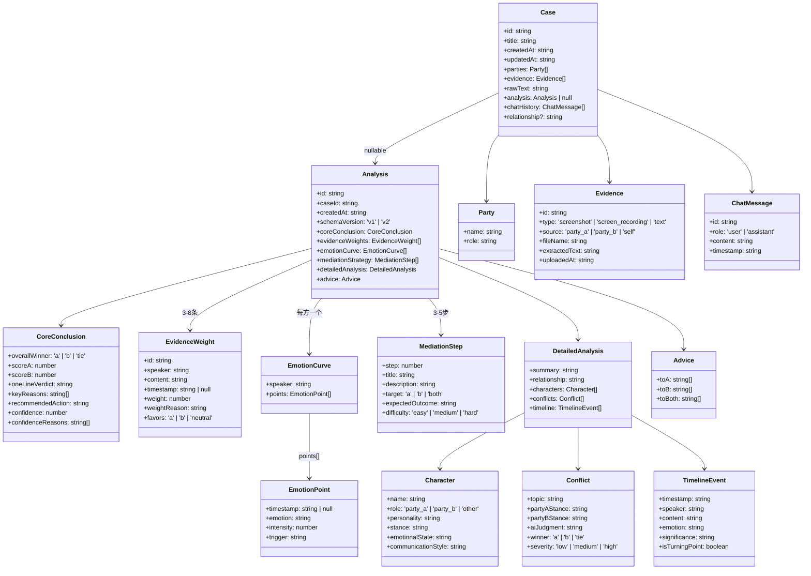
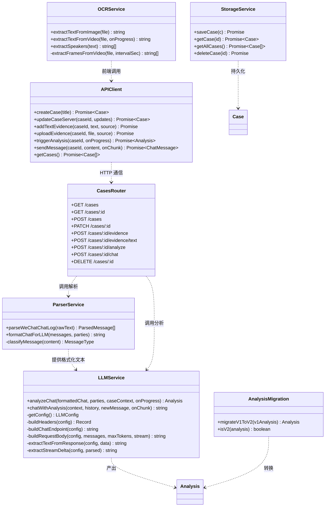
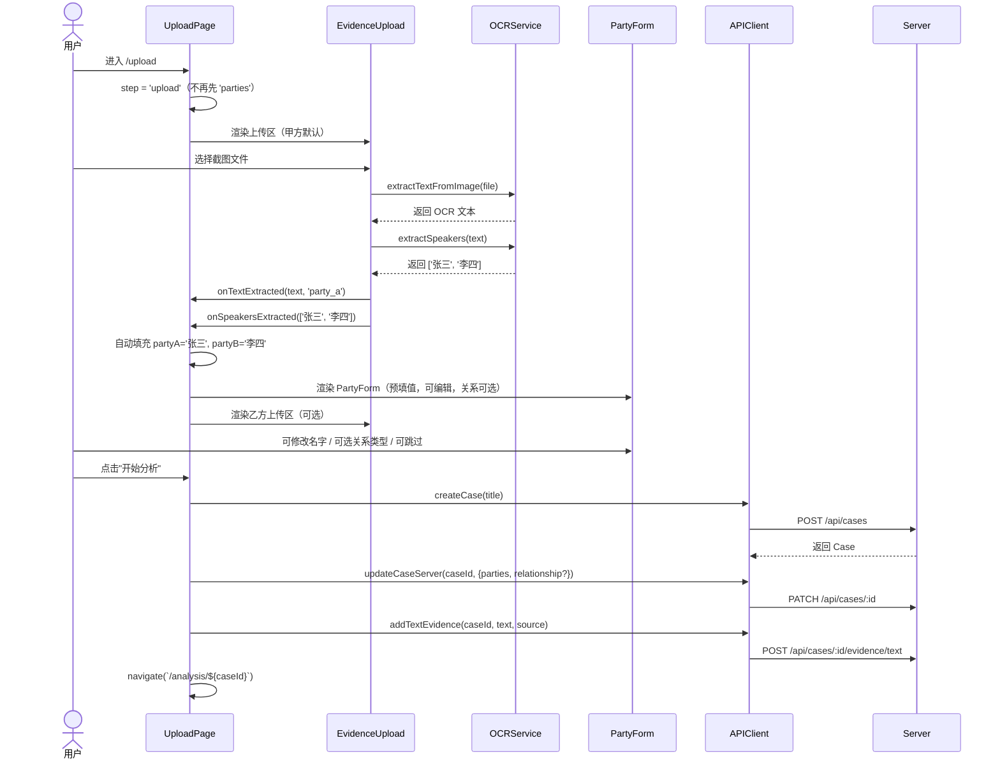
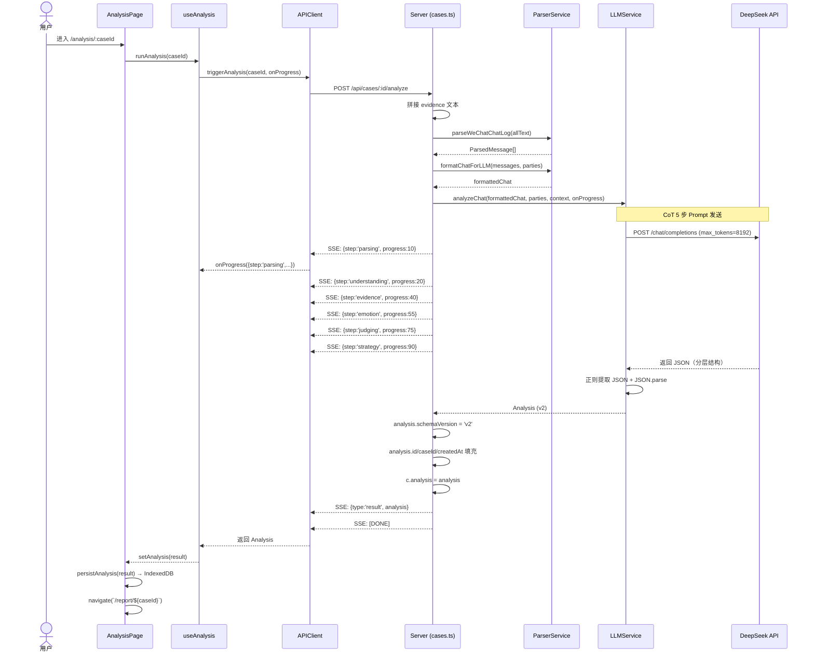
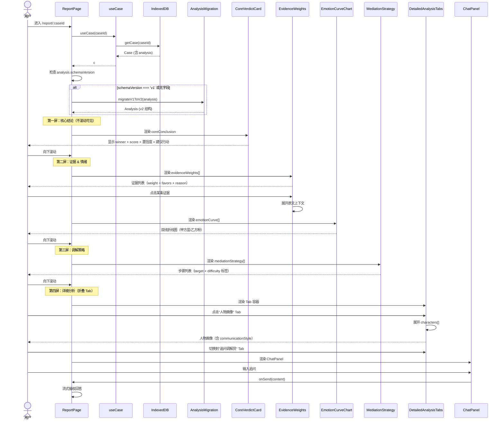
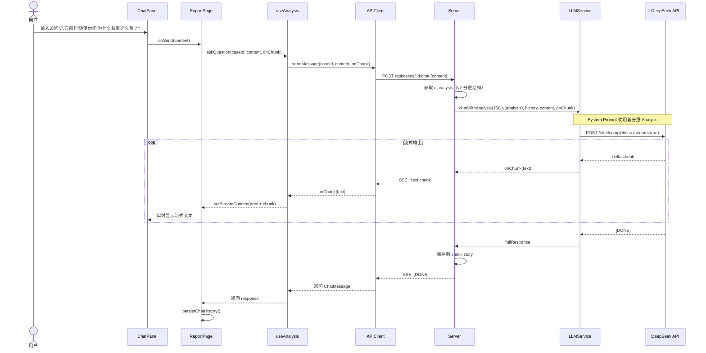
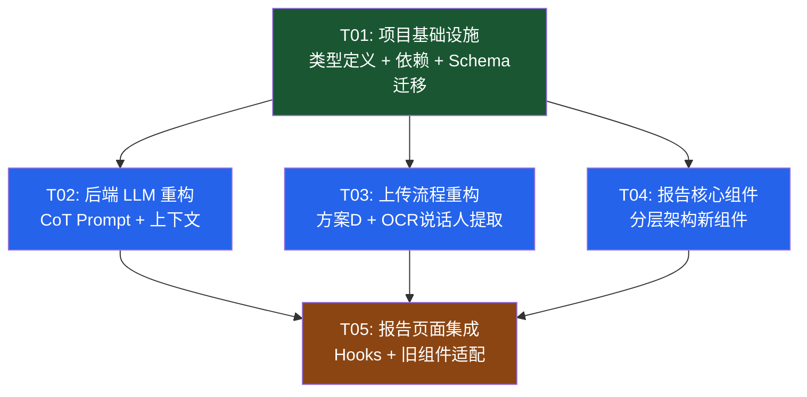

# AI 调解员 — 系统架构设计 + 任务分解

> **版本**: v2.0-architecture
> **日期**: 2025-07-11
> **作者**: 高见远（架构师）
> **基于**: PRD-redesign.md v2.0
> **状态**: 待评审

---

## 目录

1. [实现方案与框架选型](#1-实现方案与框架选型)
2. [文件列表](#2-文件列表)
3. [数据结构与接口（类图）](#3-数据结构与接口类图)
4. [程序调用流程（时序图）](#4-程序调用流程时序图)
5. [任务列表](#5-任务列表)
6. [依赖包列表](#6-依赖包列表)
7. [共享知识](#7-共享知识跨文件约定)
8. [待明确事项](#8-待明确事项)
9. [任务依赖图](#9-任务依赖图)

---

## 1. 实现方案与框架选型

### 1.1 核心技术挑战

| # | 挑战 | 难度 | 涉及需求 |
|---|------|------|---------|
| C1 | 新旧 Analysis 结构兼容——IndexedDB 中已有 v1 格式数据，前端需同时渲染 v1/v2 | 中 | Q7 |
| C2 | CoT Prompt 输出更大的分层 JSON（预计 3000-6000 tokens），需提升 max_tokens 且保证 JSON 解析鲁棒 | 中 | P0-02, Q2 |
| C3 | OCR 说话人自动提取——微信截图格式不统一，OCR 结果可能有噪声 | 中 | P1-03, Q3 |
| C4 | 上传流程方案D——从"先填表单再上传"改为"进入即上传，表单后置可选" | 高 | P0-01 |
| C5 | 报告 4 层信息分层架构——核心结论首屏不滚动可见，详细分析折叠 | 中 | P0-03, P1-02 |
| C6 | 情绪曲线可视化——双线折线图，轻量级，移动端友好 | 低 | P1-01, Q1 |

### 1.2 框架与库选型

#### 情绪曲线图表库：Recharts

| 候选 | Bundle Size (gzip) | 优点 | 缺点 | 决策 |
|------|-------------------|------|------|------|
| **Recharts** | ~80KB (tree-shaken) | React 原生组件、声明式 API、文档好、Tooltip 开箱即用 | 全量较大但支持 tree-shaking | ✅ **选用** |
| Chart.js + react-chartjs-2 | ~60KB | 体积小 | 命令式 API、React 集成不够自然 | ❌ |
| 自绘 SVG | 0KB | 零依赖 | 开发成本高、Tooltip/响应式需手写 | ❌ |
| visx | ~40KB (按需) | 极灵活、体积小 | 学习曲线陡、需自行组合 | ❌ |

**选型理由**：Recharts 是 React 生态最成熟的图表库，声明式 API 与现有代码风格一致。通过只导入 `LineChart, Line, XAxis, YAxis, Tooltip, ResponsiveContainer, Legend`（tree-shaking），实际 gzip 体积约 80KB，对移动端可接受。情绪曲线只需一个双线折线图，Recharts 完全胜任。

#### OCR 说话人提取方案：正则匹配

```
策略：复用 parser.ts 已有的 speakerContentRegex 思路
正则：/^(.+?)[：:]\s*(.*)$/  （匹配 "张三: 消息内容" 或 "张三：消息内容"）
流程：
  1. OCR 提取全文
  2. 按行扫描，匹配 "XXX:" 格式
  3. 收集所有不同的说话人名（去重，保留出现顺序）
  4. 取前 2 个作为甲乙方候选
  5. 回调通知 UploadPage 填充表单
鲁棒性处理：
  - 过滤长度 > 20 的"名字"（OCR 噪声）
  - 过滤纯数字/纯符号行
  - 如果只提取到 1 个名字，只填甲方，乙方留空
  - 如果提取到 0 个名字，不填充，用户手动输入
```

#### 新旧 Analysis 结构兼容方案：schemaVersion

```typescript
// Analysis 新增字段
interface Analysis {
  schemaVersion: 'v1' | 'v2';  // 新增
  // v2 结构字段...
}

// 迁移策略：
// 1. 新分析结果始终标记 schemaVersion: 'v2'
// 2. 前端渲染前检查 schemaVersion
// 3. 若为 v1（旧数据），调用 migrateV1ToV2() 转换结构
// 4. 迁移是纯前端的惰性转换——不修改 IndexedDB 原数据，只在渲染时转换
// 5. 若无 schemaVersion 字段，按 v1 处理（向后兼容）
```

### 1.3 架构模式

保持现有架构不变：
- **前端**：React SPA + 页面路由（react-router-dom），状态管理用 React Hooks（无全局状态库）
- **后端**：Express REST API + SSE 流式响应，内存 Map 存储
- **前后端通信**：fetch + SSE（分析进度、追问流式输出）
- **数据流**：前端 IndexedDB（持久化） ↔ 后端内存 Map（分析时临时存储）

---

## 2. 文件列表

### 2.1 需要修改的文件

| 文件路径 | 修改内容概要 | 涉及任务 |
|---------|------------|---------|
| `src/types/index.ts` | 重写 Analysis 类型：新增 CoreConclusion、EvidenceWeight、EmotionCurve、MediationStep 等接口；Character/TimelineEvent/Conflict 新增字段；Analysis 增加 schemaVersion | T01 |
| `server/src/types.ts` | 镜像前端新类型定义，保持前后端一致 | T01 |
| `server/src/services/llm.ts` | 替换 ANALYSIS_PROMPT 为 CoT 5 步思维链 Prompt；max_tokens 4096→8192；chatWithAnalysis 上下文使用新分层结构 | T02 |
| `server/src/routes/cases.ts` | analyze 端点：传递新 parties 格式；chat 端点：序列化新 Analysis 结构作为上下文 | T02 |
| `src/pages/UploadPage.tsx` | 重写上传流程（方案D）：进入即上传，移除强制表单步骤；OCR 后自动提取说话人填充表单；表单可编辑、关系后置可选 | T03 |
| `src/components/EvidenceUpload.tsx` | 新增 onSpeakersExtracted 回调；OCR 完成后调用说话人提取 | T03 |
| `src/components/PartyForm.tsx` | 改为可编辑模式：接受 initialParties prop 预填值；关系类型后置为可选；支持"跳过"按钮 | T03 |
| `src/utils/ocr.ts` | 新增 extractSpeakers(text) 函数：正则提取说话人名 | T03 |
| `src/services/api.ts` | 类型注解更新（返回值类型跟随新 Analysis）；新增 updateParties 方法 | T03 |
| `src/pages/ReportPage.tsx` | 重写报告布局：4 层递进结构（核心结论→证据情绪→策略→折叠详细分析） | T05 |
| `src/hooks/useAnalysis.ts` | 更新 AnalysisProgress 的 step 类型，适配 CoT 5 步流程 | T05 |
| `src/components/CharacterMap.tsx` | 适配新 Character 类型（新增 communicationStyle 字段） | T05 |
| `src/components/Timeline.tsx` | 适配新 TimelineEvent 类型（新增 isTurningPoint 字段） | T05 |
| `src/components/ReportSummary.tsx` | 适配新 Analysis 结构（summary 移入 detailedAnalysis） | T05 |
| `package.json` | 新增 recharts 依赖 | T01 |

### 2.2 需要新建的文件

| 文件路径 | 用途 | 涉及任务 |
|---------|------|---------|
| `src/utils/analysisMigration.ts` | v1→v2 Analysis 结构迁移函数 `migrateV1ToV2()` | T01 |
| `server/src/prompts/analysisPrompt.ts` | CoT 5 步思维链分析 Prompt 模板（从 llm.ts 抽出） | T02 |
| `server/src/prompts/chatPrompt.ts` | 追问系统 Prompt 模板（使用新分层 Analysis 上下文） | T02 |
| `src/components/CoreVerdictCard.tsx` | 报告第一屏：胜方+分数+一句话结论+核心原因+置信度+建议行动 | T04 |
| `src/components/EvidenceWeights.tsx` | 报告第二屏：证据权重列表，每条可展开原文上下文 | T04 |
| `src/components/EmotionCurveChart.tsx` | 报告第二屏：双方情绪曲线双线折线图（Recharts） | T04 |
| `src/components/MediationStrategy.tsx` | 报告第三屏：调解策略步骤列表（target+difficulty 标签） | T04 |
| `src/components/DetailedAnalysisTabs.tsx` | 报告第四屏：折叠 Tab 区（人物画像/争议焦点/时间线/追问） | T04 |

### 2.3 不需要修改的文件

| 文件路径 | 原因 |
|---------|------|
| `src/App.tsx` | 路由结构不变（/, /upload, /analysis, /report） |
| `src/utils/storage.ts` | IndexedDB 存储逻辑不变，Analysis 是透明 JSON |
| `src/components/Header.tsx` | 通用头部组件不变 |
| `src/components/Layout.tsx` | 布局容器不变 |
| `src/components/UploadZone.tsx` | 底层上传区不变 |
| `src/components/ChatPanel.tsx` | 追问面板不变（数据源 chatHistory 不变） |
| `src/components/AnalysisProgress.tsx` | 进度展示组件不变（AnalysisProgress 类型兼容） |
| `src/components/CaseCard.tsx` | 案例卡片不变 |
| `src/components/ErrorBoundary.tsx` | 错误边界不变 |
| `src/hooks/useCase.ts` | 案例 hook 不变（Case 结构核心未变） |
| `src/pages/HomePage.tsx` | 首页不变 |
| `server/src/index.ts` | Express 入口不变 |
| `server/src/services/parser.ts` | 聊天记录解析器不变（格式化逻辑复用） |

---

## 3. 数据结构与接口（类图）

### 3.1 前端类型定义（src/types/index.ts）



### 3.2 服务类型定义（server/src/types.ts）

服务端类型与前端完全镜像，确保类型一致。类图结构同上。

### 3.3 服务类



### 3.4 API 接口变化

| 端点 | 方法 | 变化 | 说明 |
|------|------|------|------|
| `/api/cases` | GET | 无变化 | 返回 Case 列表 |
| `/api/cases` | POST | 无变化 | 创建 Case |
| `/api/cases/:id` | GET | 无变化 | 获取单个 Case |
| `/api/cases/:id` | PATCH | 无变化 | 更新 Case（含 parties 修改） |
| `/api/cases/:id/evidence` | POST | 无变化 | 上传文件证据 |
| `/api/cases/:id/evidence/text` | POST | 无变化 | 添加文本证据 |
| `/api/cases/:id/analyze` | POST | **返回值变化** | SSE 流中 `result` 事件的 `analysis` 字段改为 v2 结构 |
| `/api/cases/:id/chat` | POST | **上下文变化** | 后端序列化新分层 Analysis 作为 LLM 上下文 |
| `/api/cases/:id` | DELETE | 无变化 | 删除 Case |

**关键变化说明**：
- `analyze` 端点：SSE 进度事件的 step 字段新增 `understanding`/`evidence`/`emotion`/`judging`/`strategy`（对应 CoT 5 步），但保持 `{type, step, message, progress}` 格式不变
- `chat` 端点：`chatWithAnalysis` 的 context 参数从旧 JSON 改为新分层 JSON，system prompt 更新以引导 AI 引用证据权重和情绪数据

---

## 4. 程序调用流程（时序图）

### 4.1 新上传流程（方案D）



### 4.2 新分析流程（CoT Prompt）



### 4.3 报告渲染流程



### 4.4 追问流程（上下文增强）



---

## 5. 任务列表

### T01: 项目基础设施（类型定义 + 依赖声明 + Schema 迁移）

| 属性 | 值 |
|------|-----|
| **任务ID** | T01 |
| **任务名** | 项目基础设施（类型定义 + 依赖声明 + Schema 迁移） |
| **优先级** | P0 |
| **依赖** | 无 |
| **预估复杂度** | 中 |

**涉及文件**：
- `package.json` — 新增 recharts 依赖
- `src/types/index.ts` — 重写 Analysis 类型体系（CoreConclusion、EvidenceWeight、EmotionCurve、MediationStep、DetailedAnalysis 等），Character/TimelineEvent/Conflict 新增字段，Analysis 增加 schemaVersion
- `server/src/types.ts` — 镜像前端新类型
- `src/utils/analysisMigration.ts` — 新建：v1→v2 迁移函数 `migrateV1ToV2()`，`isV2()` 判断函数

**验收标准**：
1. `npm install` 成功安装 recharts
2. TypeScript 编译通过（`tsc --noEmit`）
3. 迁移函数能将旧 Analysis（含 verdict/summary/characters）转换为新结构（coreConclusion/detailedAnalysis）
4. 前后端类型定义一致

---

### T02: 后端 LLM 重构（CoT Prompt + 分析/追问上下文）

| 属性 | 值 |
|------|-----|
| **任务ID** | T02 |
| **任务名** | 后端 LLM 重构（CoT Prompt + 分析/追问上下文） |
| **优先级** | P0 |
| **依赖** | T01 |
| **预估复杂度** | 高 |

**涉及文件**：
- `server/src/services/llm.ts` — 替换 ANALYSIS_PROMPT 为 CoT 5 步思维链；max_tokens 4096→8192；更新 chatWithAnalysis 的 system prompt
- `server/src/prompts/analysisPrompt.ts` — 新建：CoT 分析 Prompt 模板（从 llm.ts 抽出，便于维护）
- `server/src/prompts/chatPrompt.ts` — 新建：追问系统 Prompt 模板（引导 AI 引用证据权重、情绪数据）
- `server/src/routes/cases.ts` — analyze 端点更新进度步骤名；chat 端点确认序列化新结构

**验收标准**：
1. 分析端点返回的 JSON 符合新 schema（coreConclusion/evidenceWeights/emotionCurve/mediationStrategy/detailedAnalysis/advice）
2. LLM 输出包含 3-8 条证据权重，每条有 weight/favors/weightReason
3. 置信度 0-100 + 至少 1 条原因
4. 调解策略 3-5 步，每步有 target/expectedOutcome/difficulty
5. 情绪曲线双方各有数据点
6. SSE 进度事件包含 CoT 5 步对应的消息
7. 追问能引用具体证据权重回答

---

### T03: 上传流程重构（方案D + OCR 说话人提取）

| 属性 | 值 |
|------|-----|
| **任务ID** | T03 |
| **任务名** | 上传流程重构（方案D + OCR 说话人提取） |
| **优先级** | P0 |
| **依赖** | T01 |
| **预估复杂度** | 高 |

**涉及文件**：
- `src/pages/UploadPage.tsx` — 重写：进入即上传（step 初始值改为 'upload'），移除强制表单步骤；OCR 后自动填充说话人；表单可编辑、关系后置可选
- `src/components/EvidenceUpload.tsx` — 新增 onSpeakersExtracted 回调 prop；OCR 完成后调用说话人提取
- `src/components/PartyForm.tsx` — 改为可编辑模式：接受 initialParties prop 预填值；关系类型后置为可选；支持"跳过"逻辑
- `src/utils/ocr.ts` — 新增 extractSpeakers(text) 函数：正则提取说话人名
- `src/services/api.ts` — 类型注解更新；确保 addTextEvidence 返回类型正确

**验收标准**：
1. 进入 /upload 页面 ≤1s 看到上传区（无表单阻断）
2. 上传截图后 OCR 自动提取说话人名字（≥1 个）
3. 提取的名字自动填充到甲乙方输入框
4. 用户可修改填充的名字
5. 关系类型为可选项，不选也能分析
6. 第一个上传默认标记为甲方，后续可选乙方/自己

---

### T04: 报告核心组件（分层架构新组件）

| 属性 | 值 |
|------|-----|
| **任务ID** | T04 |
| **任务名** | 报告核心组件（分层架构新组件） |
| **优先级** | P0 |
| **依赖** | T01 |
| **预估复杂度** | 中 |

**涉及文件**：
- `src/components/CoreVerdictCard.tsx` — 新建：第一屏核心结论（winner + scoreA/scoreB + oneLineVerdict + keyReasons + confidence 进度条 + confidenceReasons + recommendedAction）
- `src/components/EvidenceWeights.tsx` — 新建：证据权重列表（每条显示 weight 条 + favors 标签 + speaker + content + weightReason），点击展开原文上下文
- `src/components/EmotionCurveChart.tsx` — 新建：Recharts 双线折线图（X 轴消息序号/时间，Y 轴 0-100 强度，甲方蓝/乙方粉），hover 显示 emotion + trigger
- `src/components/MediationStrategy.tsx` — 新建：调解策略步骤列表（step 号 + title + description + target 标签 + expectedOutcome + difficulty 标签）
- `src/components/DetailedAnalysisTabs.tsx` — 新建：折叠 Tab 容器（人物画像/争议焦点/时间线/追问调解员），默认折叠

**验收标准**：
1. CoreVerdictCard 首屏不滚动可见全部核心信息
2. 置信度进度条有视觉区分（高/中/低）
3. EvidenceWeights 每条证据有 weight 条 + favors 标签
4. 点击证据可展开/收起原文上下文
5. EmotionCurveChart 双线折线图正常渲染
6. MediationStrategy 每步有 target + difficulty 标签
7. DetailedAnalysisTabs 默认折叠，点击展开

---

### T05: 报告页面集成 + Hooks 适配 + 旧组件适配

| 属性 | 值 |
|------|-----|
| **任务ID** | T05 |
| **任务名** | 报告页面集成 + Hooks 适配 + 旧组件适配 |
| **优先级** | P0 |
| **依赖** | T01, T02, T03, T04 |
| **预估复杂度** | 中 |

**涉及文件**：
- `src/pages/ReportPage.tsx` — 重写报告布局：4 层递进结构（CoreVerdictCard → EvidenceWeights + EmotionCurveChart → MediationStrategy → DetailedAnalysisTabs）；渲染前检查 schemaVersion 并迁移
- `src/hooks/useAnalysis.ts` — 更新 AnalysisStep 类型：新增 understanding/evidence/emotion/judging/strategy 步骤
- `src/components/CharacterMap.tsx` — 适配新 Character 类型（新增 communicationStyle 字段显示）
- `src/components/Timeline.tsx` — 适配新 TimelineEvent 类型（新增 isTurningPoint 视觉标记）
- `src/components/ReportSummary.tsx` — 适配新结构（summary 从 analysis 顶层移入 detailedAnalysis）

**验收标准**：
1. 报告页面 4 层结构清晰：结论→证据情绪→策略→折叠详细分析
2. 旧 v1 格式 Analysis 能正常渲染（迁移后显示）
3. 新 v2 格式 Analysis 完整渲染所有层级
4. 滚动体验流畅
5. 追问功能正常（ChatPanel 嵌入 DetailedAnalysisTabs 的第 4 个 Tab）
6. 补充证据 + 重新分析流程正常

---

## 6. 依赖包列表

### 新增依赖

| 包名 | 版本 | 用途 | 安装位置 |
|------|------|------|---------|
| `recharts` | `^2.12.0` | 情绪曲线折线图可视化 | 前端 (package.json) |

**Recharts tree-shaking 策略**：
```typescript
// 只导入需要的组件，减小 bundle
import {
  LineChart, Line, XAxis, YAxis,
  Tooltip, ResponsiveContainer, Legend
} from 'recharts'
```

### 无需新增的依赖

| 包名 | 已有版本 | 说明 |
|------|---------|------|
| `tesseract.js` | ^5.1.1 | OCR 识别（已有，仅新增 extractSpeakers 工具函数） |
| `idb` | ^8.0.0 | IndexedDB 封装（已有，无需变化） |
| `react-router-dom` | ^6.23.1 | 路由（已有，无需变化） |
| `express` | ^4.19.2 | 后端框架（已有，无需变化） |

---

## 7. 共享知识（跨文件约定）

### 7.1 前后端类型同步策略

```
约定：src/types/index.ts 和 server/src/types.ts 必须保持 Analysis 相关类型定义完全一致。

实施方式：
1. 以 src/types/index.ts 为"源头"（source of truth）
2. server/src/types.ts 手动镜像（不使用共享包，避免 monorepo 复杂度）
3. 每次修改类型时，两个文件必须同步修改
4. PR 审查时检查两文件一致性
```

### 7.2 Prompt 模板管理

```
约定：Prompt 模板从 llm.ts 抽出到独立文件，便于版本管理和迭代。

文件结构：
  server/src/prompts/
    analysisPrompt.ts  — 分析 Prompt（CoT 5 步）
    chatPrompt.ts      — 追问系统 Prompt

调用方式：
  import { ANALYSIS_PROMPT } from '../prompts/analysisPrompt.js'
  import { buildChatSystemPrompt } from '../prompts/chatPrompt.js'

版本管理：
  - Prompt 修改时在文件头部注释记录版本号和变更日期
  - 重大修改保留旧版本注释（便于回滚对比）
```

### 7.3 schemaVersion 约定

```
约定：所有新分析的 Analysis 必须标记 schemaVersion: 'v2'。

判断逻辑（前端）：
  - analysis.schemaVersion === 'v2' → 直接渲染
  - analysis.schemaVersion === 'v1' 或无此字段 → 调用 migrateV1ToV2() 后渲染

迁移函数（src/utils/analysisMigration.ts）：
  - 纯函数，不修改原对象，返回新对象
  - v1 的 verdict → v2 的 coreConclusion
  - v1 的 summary/characters/timeline/conflicts → v2 的 detailedAnalysis
  - v1 缺失的字段（evidenceWeights/emotionCurve/mediationStrategy）填充空数组
  - confidence 默认 50，confidenceReasons 默认 ['旧格式分析，无置信度数据']
```

### 7.4 SSE 事件格式约定

```
分析端点（/analyze）SSE 事件格式（不变）：
  data: {"type":"progress","step":"understanding","message":"正在理解对话...","progress":20}
  data: {"type":"result","analysis":{...v2结构...}}
  data: [DONE]

追问端点（/chat）SSE 事件格式（不变）：
  data: "文本片段"
  data: {"error":"错误信息"}
  data: [DONE]
```

### 7.5 CoT 进度步骤映射

```
CoT 5 步 → SSE progress 事件映射：
  第1步 理解对话  → {step:'understanding', progress:20, message:'正在理解对话上下文...'}
  第2步 提取证据  → {step:'evidence',     progress:40, message:'正在提取关键证据...'}
  第3步 追踪情绪  → {step:'emotion',      progress:55, message:'正在分析情绪变化...'}
  第4步 综合判断  → {step:'judging',      progress:75, message:'正在综合判断...'}
  第5步 制定策略  → {step:'strategy',     progress:90, message:'正在制定调解策略...'}
  完成           → {step:'done',         progress:100, message:'分析完成'}
```

### 7.6 Evidence source 值约定

```
Evidence.source 值含义（不变）：
  'party_a' — 甲方提供的证据
  'party_b' — 乙方提供的证据
  'self'    — 用户自己的证据（方案D中第一个上传默认为 party_a）

方案D上传逻辑：
  1. 第一个上传 → source = 'party_a'（固定）
  2. 后续上传 → 用户可选择 'party_b' 或 'self'
  3. 关系类型后置为可选，不影响分析流程
```

---

## 8. 待明确事项

| # | 问题 | 影响范围 | 当前假设 | 建议解决方式 |
|---|------|---------|---------|------------|
| A1 | DeepSeek API max_tokens 提升到 8192 是否够用？新结构预计 3000-6000 tokens | 后端 T02 | 假设 8192 足够 | 实际测试后确认；若不够考虑拆分为两次请求（先分析→再策略） |
| A2 | OCR 说话人提取的准确率？微信截图格式多样（有/无时间戳、有/无头像名） | 前端 T03 | 正则匹配 "XXX:" 格式，取前 2 个不同名字 | 上线后收集 bad case，迭代正则规则；提供手动修改兜底 |
| A3 | 旧 v1 数据迁移是否需要持久化到 IndexedDB？还是每次渲染时惰性转换？ | 前端 T01 | 惰性转换，不修改原数据 | 若性能无问题保持惰性；若频繁迁移影响性能，考虑在 getCase 时自动升级并持久化 |
| A4 | 情绪曲线 X 轴用消息序号还是时间戳？聊天记录可能无精确时间 | 前端 T04 | 优先用时间戳，无时间戳时用消息序号 | EmotionPoint.timestamp 为 null 时，前端用 points 数组 index 作为 X 轴 |
| A5 | 报告页是否需要支持桌面端宽屏？当前 mobile-first | 前端 T05 | 保持 mobile-first，Tailwind 响应式默认适配 | 现有 Tailwind 配置已支持响应式，组件用 max-w 容器即可 |
| A6 | 追问 system prompt 如何引导 AI 引用证据权重？ | 后端 T02 | 在 system prompt 中明确列出 Analysis 的分层结构说明 | chatPrompt.ts 中添加结构说明："你可以引用 evidenceWeights 中的具体证据、emotionCurve 中的情绪数据来回答" |
| A7 | EvidenceWeights 组件点击展开"原文上下文"——上下文从哪里获取？ | 前端 T04 | 从 Case.rawText 或 evidence.extractedText 中搜索匹配 | 搜索 evidenceWeights[].content 在 rawText 中的位置，展示前后各 2 条消息作为上下文 |

---

## 9. 任务依赖图



**并行机会**：T01 完成后，T02、T03、T04 可以并行开发（三者互不依赖），最后由 T05 集成。

---

## 附录：设计决策记录

### D1: 为什么不用共享类型包（monorepo）？

当前项目规模小（前端 + 后端各一个 package），引入 monorepo 工具链（如 turborepo / nx）的复杂度收益不对等。手动镜像两个 types.ts 文件的成本可控，且 PR 审查时容易发现不一致。

### D2: 为什么 Prompt 模板抽到独立文件而非留在 llm.ts？

Prompt 是本次重构的核心变更点（CoT 5 步），且后续可能频繁迭代。独立文件使得：
- 修改 Prompt 不触碰 LLM 调用逻辑（单一职责）
- 可以在文件头部维护版本历史
- 未来支持多套 Prompt（A/B 测试）时更容易扩展

### D3: 为什么用 schemaVersion 而非直接覆盖旧数据？

惰性迁移策略保护用户已有数据，避免迁移失败导致数据丢失。且旧数据量可能不大（产品早期），惰性转换的性能开销可忽略。

### D4: 为什么 DetailedAnalysisTabs 包含追问 ChatPanel？

PRD 第5节明确将"追问调解员"作为第四屏的一个 Tab。ChatPanel 组件本身不变，只是被嵌入 DetailedAnalysisTabs 的第 4 个 Tab 中。这样报告页第四屏统一为 Tab 切换交互。
